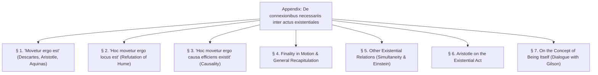
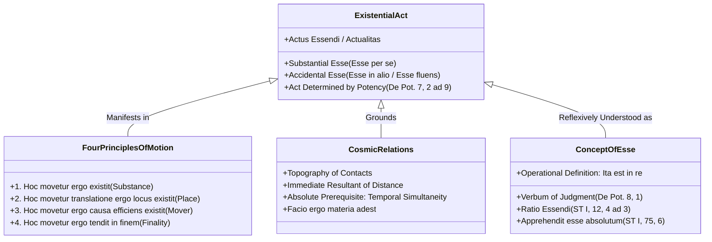

# APPENDIX SUMMARY & ANALYTICAL OUTLINE

**Work:** Petrus Hoenen, S.J., *De Noetica Geometriae: Origine Theoriae Cognitionis* (Rome: Gregorian University Press, 1954)  
**Section:** Appendix: *De connexionibus necessariis inter actus existentiales* (pp. 249–288)  

---

## Executive Summary

The Appendix to *De Noetica Geometriae*, originally published in *Gregorianum* (1953) as a standalone philosophical treatise, serves as the **crowning metaphysical capstone** of Father Petrus Hoenen's epistemological work. 

While the preceding seven chapters established that the intellect intuits necessary and exact relations between *forms and quiddities* in intelligible matter (*nexus formales*), the Appendix proves that the human mind also intuits **necessary connections directly between existential acts** (*actus existentiales*).

The central conclusions of the Appendix are:

1. **The Extension of Intuitive Abstraction to Existence:**
   - Classical epistemology recognized necessary relations between essences ($A$ is figurable because $A$ is extended).
   - Hoenen proves that the intellect also intuits necessary relations between *acts of existing*: *"It is moved, therefore it is"* (*Movetur ergo est*).
2. **Descartes and the Scholastics on *Cogito Ergo Sum*:**
   - The Cartesian *cogito* is not a deductive syllogism, but a **simple intuition of the intellect** in internal experience, perceiving accidental *esse* (thinking) as necessarily presupposing substantial *esse* (the self).
   - This exact doctrine was formulated centuries earlier by Aristotle (*Nic. Eth.* IX, 9) and St. Thomas (*Q.D. de Veritate*, q. 10, a. 12, ad 7).
3. **The Four Existential Principles of Motion:**
   - Transposing this intuition to external sensible reality, Hoenen establishes four fundamental existential illations regarding physical motion:
     1. *Hoc movetur ergo existit* (Substantial Subject)
     2. *Hoc movetur translatione ergo locus existit* (Place / Space)
     3. *Hoc movetur ergo causa efficiens existit* (Efficient Causality)
     4. *Hoc movetur ergo tendit in finem producendum* (Finality)
4. **The Direct Refutation of David Hume:**
   - Hume asserted that the mind can never see a necessary connection between the existence of one thing and the existence of another.
   - Hoenen demonstrates that physical motion **"points, as with a finger, to another presupposed existence"** (*motus quasi digito monstrat aliam existentiam*): motion cannot exist without an existing subject, place, and actual moving cause.
   - The causal principle is an immediate intellective intuition, not an empirical habit of constant conjunction.
5. **The Realist Critique of Albert Einstein:**
   - Spatial distance between bodies requires mutual contact across an intermediate body.
   - Hoenen discovers that this contact is impossible unless the bodies **exist simultaneously in duration**.
   - Coexistence in duration is an absolute ontological prerequisite for spatial relations, invalidating Einstein’s operational dismissal of absolute simultaneity.
6. **Resolving Étienne Gilson’s "Center of Darkness":**
   - Hoenen resolves the modern dilemma between "essentialist" and "existentialist" Thomism:
   - *Esse* is indeed conceptualizable as a *ratio essendi* and interior word (*conceptio mentis*) of judgment.
   - *Esse* is determined by essence **not as potency by act, but as act by potency** (*De Potentia*, q. 7, a. 2, ad 9).
   - An operational definition of *esse* is established: *that which affirmative judgment attributes to an apprehended disposition of the thing* (*« ita est in re »*).

---

## Detailed Section-by-Section Outline

---

### § 1. "It is moved, therefore it is" (*« Movetur ergo est »*) (pp. 249–258)

- **1. Analysis of Descartes' *Cogito Ergo Sum*:**
  - In *Secundae Responsiones*, Descartes explains that the *cogito* is **not a syllogism** (it does not presuppose the major premise *"everything that thinks exists"*).
  - It is a **simple intuition of the intellect** in internal experience: *I who think necessarily am*.
  - Accidental *esse* (thinking) is known first; substantial *esse* (the self) is ontologically prior.
- **2. Scholastic Precedence (Aristotle and St. Thomas):**
  - Aquinas (*Q.D. de Veritate*, q. 10, a. 12, ad 7): One cannot think that one is not with assent, because in the very act of thinking, one perceives oneself to be.
  - The universal scholastic axiom: **"Action follows upon actual being"** (*« agere sequitur ad esse in actu »*).
- **3. Transposition to External Perception (*Movetur Ergo Est*):**
  - In bodies, motion is an accidental existential act (*esse fluens*).
  - Aristotle (*Phys.* V, 1, 225a25): Non-being cannot be moved (ἀδύνατον γὰρ τὸ μὴ ὂν κινεῖσθαι).
  - Aquinas (*In V Phys.*, lect. 2, no. 8): What is moved is necessarily being simply.
  - We arrive at the universal principle: **"Being moved follows upon being"** (*« moveri sequitur esse »*).
- **4. Genesis of the Concept of Actuality (*Energeia*):**
  - Aristotle (*Metaph.* IX, 3, 1047a30): The word *energeia* (actuality) was originally applied **to movement** (*ek tōn kinēseōn*), because motion is the most obvious actuality to human sense.
  - Alexander of Aphrodisias (*In Metaph.* 573): ἡ ἐνέργεια ἐν κινήσει θεωρεῖται (*"actuality is contemplated in motion"*).
  - Motion is known first in cognition; substantial *esse* is prior by nature.
- **5. Comparison with Quidditative Principles:**
  - *Mathematical principle:* *Extensum est figurabile* (nexus between two forms/essences; subject is prior by nature and cognition).
  - *Existential principle:* *Hoc movetur ergo est* (nexus between two existential acts; predicate is prior by nature, but subject is prior in cognition).

---

### § 2. "This is moved, therefore place is" (*« Hoc movetur ergo locus est »*) (pp. 258–263)

- **1. Aristotle's Treatise on Place (*Physica* IV, 1–8):**
  - Place (*topos*) is an accident (the inner boundary of the surrounding body).
  - Place is discovered through the motion of translation (*translatio*).
  - The universe as a whole is not in a place (*Phys.* IV, 5, 212b14).
- **2. Refutation of David Hume and Immanuel Kant:**
  - Hume claimed that the intellect can never see a necessary relation between the existence of one thing and that of another.
  - Hoenen’s discovery: In local motion, the intellect intuits that motion **"points, as with a finger, to another presupposed existence"** (*motus quasi digito monstrat aliam existentiam*).
  - Motion is a fluent existence that cannot occur without the actual existence of place (*locus*).

---

### § 3. "This is moved, therefore another, moving, exists" (*« Hoc movetur, ergo aliud, movens, existit »*) (pp. 263–268)

- **1. The Principle of Causality in Motion:**
  - Pure motion considered in isolation lacks full intelligibility; it demands an external actual agent: *omne quod movetur ab alio movetur*.
  - Aristotle (*Metaph.* IX, 8; XII, 6, 1071b28): πῶς γὰρ κινηθήσεται, εἰ μὴ ἔσται ἐνεργείᾳ τι αἴτιον (*"for how will it be moved, if there is not in actuality some cause?"*).
- **2. Refutation of Hume's "Constant Conjunction":**
  - The principle of causality is **not** derived from repeated empirical observation of temporal succession.
  - The intellect grasps the necessity of an actual cause immediately in any motion whatever, even in a single instance or in inertial motion.
  - Historical example: Isaac Newton discovering the sun as the cause of planetary orbits.
- **3. Necessary Principle vs. Free Cause:**
  - The causal principle demands that an actual cause exist; it does **not** demand that the cause be a "necessary" (deterministic) cause. A free cause completely satisfies the principle.

---

### § 4. On Finality in Motion & Recapitulation (pp. 268–272)

- **1. Teleology in Continuous Motion:**
  - Continuous motion cannot possess unity without an end (*telos*).
  - The end is "posterior in genesis, but prior by nature" (*Metaph.* IX, 6).
  - Aristotle (*Phys.* VIII, 7, 261a13): τὸ γιγνόμενον ἀτελὲς καὶ ἐπ᾽ ἀρχὴν ἴον (*"that which becomes is incomplete and goes toward a principle"*).
  - *Hoc movetur ergo terminus intentionaliter existit* ("This is moved, therefore the end intentionally exists").
- **2. The Fourfold Framework of Existential Principles:**
  1. *Hoc movetur ergo existit* (Substance)
  2. *Hoc movetur translatione, ergo locus existit* (Place / Space)
  3. *Hoc movetur ergo causa efficiens existit* (Efficient Cause)
  4. *Hoc movetur ergo tendit in finem producendum* (Final Cause)
- **3. Cognitive vs. Ontological Asymmetry:**
  - In all four, what is known first by us (*antecedent*) is ontologically posterior; what is ontologically prior (*consequent*) is known second.
  - Noetics transforms these truths from *actus exercitus* into *actus signatus*.

---

### § 5. Certain Other Existential Relations (pp. 272–277)

- **1. The Category "Where" (*Ubi*) and Distance:**
  - "To be somewhere" (*esse alicubi*) is a predication in the line of existence.
  - Distance requires two bodies touching an intermediate body: *principle of the immediate resultant of distance*.
- **2. Discovery of the Prerequisite of Simultaneity:**
  - Two bodies cannot touch an intermediate body unless they **exist simultaneously in duration**.
  - Local relations necessarily presuppose temporal simultaneity!
- **3. Realist Critique of Albert Einstein:**
  - Einstein’s 1930 definition of space relies on mutual contacts of bodies.
  - Mutual contacts require objective simultaneous existence.
  - Therefore, Einstein's operational rejection of absolute simultaneity contradicts his own realist foundation of space.
- **4. "I Make, Therefore Matter is Present" (*Facio Ergo Materia Adest*):**
  - St. Thomas's epistemological criterion for distinguishing authentic perception from hallucination.
  - Physical action can only be completed upon actual, extramental matter.

---

### § 6. Aristotle on the Existential Act (pp. 277–281)

- **1. Refuting the Myth of Aristotle's "Essentialism":**
  - Counters the modern claim that Aristotle and Greek commentators ignored the act of existence.
  - *Physica* VIII, 1 (251a10): ἀναγκαῖον ἄρα ὑπάρχειν τὰ πράγματα τὰ δυνάμενα κινεῖσθαι (*"it is necessary that things capable of being moved actually exist"*).
- **2. Metaphysics of Mutability:**
  - Aristotle created the metaphysics of potency and act to answer Parmenides' denial of becoming.
  - Analyzes the **twofold function of material form**: quidditative (determining essence) and existential (actuating *esse*).

---

### § 7. On the Concept of Being Itself (*De conceptu ipsius esse*) (pp. 281–288)

- **1. Dialogue with Étienne Gilson:**
  - Gilson (*L'être et l'essence*) argued that *esse* cannot be conceptualized without falling into essentialism.
  - Hoenen shows that in St. Thomas, *conceptus* and *verbum* apply to the **second operation (judgment)** as well as the first (*De Pot.* q. 8, a. 1).
  - The intellect forms a concept of *esse* as **ratio essendi** (*ST* I, q. 12, a. 4, ad 3; q. 75, a. 6: *apprehendit esse absolutum*).
- **2. Operational Definition of *Esse*:**
  - What is *esse*? **That which affirmative judgment attributes to an apprehended disposition of the thing** (*« ita est in re »*).
- **3. Gilson's "Center of Darkness" Resolved:**
  - Diverse modes of being are diverse *seipsis totis* (by their whole selves, not by added specific differences).
  - *Esse* is determined by essence **not as potency by act, but as act by potency** (*De Pot.* q. 7, a. 2, ad 9).
- **4. Four Metaphysical Additions:**
  - *Successive Duration:* Fluent existential extension (*esse fluens*); strictly 1D, refuting Minkowski's literal 4D space.
  - *Velocity as Intensity:* Nicole Oresme’s medieval configurations of velocity in fluent *esse*; applied to sound waves and modern photons.
  - *Permanent Qualities:* Modes of inherence and degrees of intensity.
  - *Contact Aggregates:* Accidental contact imitating essential continua, explaining historical antinomies of the continuum.

---

## Thematic Architecture of the Appendix

---

## Conceptual Glossary of Latin & Greek Terms

- **Actus existentialis / Actus essendi:** The act of existence—the primary actuality of being that is not a form or quiddity.
- **Esse fluens:** Fluent being—the dynamic, successive existential act characteristic of motion and duration.
- **Motus quasi digito monstrat aliam existentiam:** "Motion points, as with a finger, to another existence"—the refutation of Humean skepticism regarding existential connections.
- **Facio ergo materia rei factibilis adest:** "I make, therefore the matter of the factible thing is present"—the operative epistemological criterion of extramental reality.
- **Ratio essendi:** The intelligible account or notion of being itself, apprehended by the intellect in abstraction from quiddity.
- **Seipsis totis:** "By their whole selves"—the Aristotelian-Thomistic distinction indicating that modes of being differ fundamentally without added specific differences.
- **Actus determinatur per potentiam:** "Act is determined by potency"—St. Thomas's principle (*De Pot.* q. 7, a. 2, ad 9) explaining how *esse* is diversified by quiddity.
- **Ita est in re:** "So it is in reality"—the formula of affirmative judgment constituting the realistic operational definition of *esse*.
- **Ἐνέργεια ἐν κινήσει θεωρεῖται (energeia en kinēsei theōreitai):** Alexander of Aphrodisias's dictum that actuality is first contemplated in motion.
