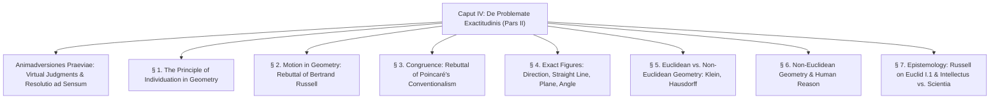

# CHAPTER SUMMARY & ANALYTICAL OUTLINE: CAPUT IV

> [Latin Text](caput-4.md) | [English Translation](caput-4-en.md) | [**AI Summary**](caput-4-summary.md) | [Translation Notes](translation-notes-caput-4.md) | [Conspectus Totius Operis](../index.md)

---
**Work:** Petrus Hoenen, S.J., *De Noetica Geometriae: Origine Theoriae Cognitionis* (Rome: Gregorian University Press, 1954)  
**Chapter:** Caput IV: *De Problemate Exactitudinis. Pars II: De Figuris et Relationibus Exactis* (pp. 95–156)  

---

## Executive Summary

Caput IV is the foundational centerpiece of Father Petrus Hoenen's epistemological masterpiece. In this chapter, Hoenen solves the second and most difficult part of the problem of geometric exactitude: **How can the human intellect, drawing all its knowledge from imperfect, approximate sensitive phantasms, arrive at apodictically necessary, mathematically exact figures (the straight line, the plane, the circle) and exact relations (congruence, parallelism, angle measurement)?**

Hoenen demonstrates that this transition is neither an arbitrary postulate (as in Hilbert's formal axiomatics) nor an empirical convention derived from physical rigid bodies (as in Poincaré), but an intellective intuition of **extension as intelligible matter** (*materia intelligibilis*), which serves as the **principle of individuation** in geometry.

Key achievements of the chapter include:
1. **The Principle of Individuation:** Homogeneous extension permits the continuous actuation of specifically identical figures differing solely by site (*situs*), providing an objective ground for exact congruence.
2. **Vindication of Euclid I.4 against Bertrand Russell:** Refutes Russell’s charge that superposition is a "logical juggle." Hoenen demonstrates that mobility is an essential property (*proprium*) of extension, and shows that Euclid I.4 can be proved either through motion or entirely statically through the principle of individuation.
3. **Direction as a Primitive Concept:** Restores direction (*modus transeundi per punctum*) as an irreducible qualitative concept abstracted from the phantasm. Refutes Hermann von Helmholtz’s claim of a vicious circle and resolves Wilhelm Killing’s critique of Leibniz's definition of parallels.
4. **Epistemological Status of Non-Euclidean Geometry:** Resolves the crisis raised by non-Euclidean geometry. Demonstrates that Euclidean geometry is the unique, necessary geometry of uncurved extension as such. Non-Euclidean geometries are genuine mathematical systems representing curved submanifolds immersed in higher-dimensional Euclidean space.
5. **Vindication of Euclid I.1 against Russell:** Demonstrates why Russell was wrong to accuse Euclid of begging the question regarding the intersection of circles in the construction of an equilateral triangle.
6. **The Partition between *Intellectus* and *Scientia*:** Demonstrates that 100% of the problem of exactitude resides in the habit of first principles (*intellectus principiorum*), while deductive science (*scientia conclusionum*) is purely formal and free from the difficulty of overcoming sensory inexactitude.

---

## Detailed Section-by-Section Outline

### Preliminary Remarks (*Animadversiones praeviae*, pp. 95–98)
- **Recapitulation of the Problem:** Sensitive experience perceives only three-dimensional bodies with fuzzy boundaries. It cannot distinguish a slightly curved line from a straight one, or verify exact congruence.
- **The Thomistic Criterion:** All human cognition arises from sense (*omnis nostra cognitio originaliter consistit in notitia primorum principiorum... quae ex sensu oritur*, St. Thomas, *De Veritate*, q. 10, a. 6). Every judgment must be resolved back to sense (*resolvere ad sensum quodammodo*, q. 12, a. 3).
- **Virtual Judgments (*Iudicia Virtualia*):** In constructing geometry, the intellect performs spontaneous intuitive-abstractive operations that grasp necessary connections without explicitly formulating them as propositional premises. These virtual judgments guide and validate the entire construction.

---

### § 1. On the Principle of Individuation in Geometry (pp. 98–104)
- **The Core Question:** Can multiple figures agree exactly in quantity and form, differing by number alone?
- **Intelligible Matter (*Materia Intelligibilis*):** Extension as such, considered prior to any limiting figure, is completely uniform and homogeneous. It serves as intelligible matter for geometry (Aristotle, *Met.* VII, 10; St. Thomas, *In De Trin.*, q. 5, a. 3, ad 3).
- **The Two Fold Elements of Individuation:**
  1. *Multiplication within the Species:* Because parts of extension are identical in nature, any figure possible in one part is possible in any other part.
  2. *Numerical Diversity via Site (*Situs*):* Figures specifically identical differ solely by their position/site in extension.
- **Continuous Variation:** The slightest continuous shift in position yields a numerically new individual. A one-meter segment contains an uncountable infinity of potential half-meter segments differing solely by site.

---

### § 2. On Motion in Geometry (pp. 104–114)
- **Euclid’s Superposition (Book I, Theorem 4):** Euclid proves SAS congruence by translating triangle $ABC$ onto triangle $DEF$.
- **Bertrand Russell’s Attack:** In *Principles of Mathematics* (1903), Russell claims motion in geometry has "no logical validity, and strikes every intelligent child as a juggle," arguing that points of space are fixed positions that cannot move.
- **Hoenen’s Refutation of Russell:**
  - Russell confuses real extended being (*ens reale extensum*) with the fictitious imaginary receptacle of space (*spatium imaginarium*).
  - Mobility is an essential *proprium* of extended being.
  - While physical causes and velocities belong to physics, two aspects of motion belong strictly to pure geometry:
    1. *The prerequisite of homogeneous extension:* the capacity of space to receive congruent figures continuously across all sites.
    2. *Direction:* motion essentially possesses an orientation (*θέσις*, Aristotle, *Phys.* IV, 11, 219a10), which is inherited from the static order of parts in extension.

---

### § 3. On the Congruence of Figures (pp. 114–121)
- **Refutation of Henri Poincaré’s Conventionalism:**
  - Poincaré claimed: *"If there were no rigid bodies in nature, there would be no geometry."*
  - Hoenen counters: Geometry requires only the *passive possibility* of continuous extension to receive congruent forms, not physical atomic rigidity or elasticity.
- **Euclid I.4 Proved Statically Without Motion:**
  - Given base point $D$, direction $DE$, side length $DE = AB$, angle $D = A$, and side $DF = AC$, a unique triangle $DEF$ is determined.
  - By the principle of individuation, a triangle congruent to $ABC$ exists in that location.
  - Since only one triangle can be constructed from those parameters, triangle $DEF$ is identically congruent to triangle $ABC$.
  - Translation is completely dispensable, though fully justified as an equivalent expression of the principle of individuation.

---

### § 4. On Exact Figures (pp. 121–139)
- **1. Axiomatics and David Hilbert:** Hilbert's *Grundlagen der Geometrie* claims to treat terms as uninterpreted symbols, but his introductory *Erklärungen* rely upon virtual judgments grounded in geometric intuition.
- **2. The Primitive Notion of Direction:** "Line $a$ passes through point $P$" contains more information than "$P$ lies on $a$": it specifies the *mode of passage* (*modus transeundi*). Direction is an irreducible qualitative concept.
- **3. The Continuum of Directions:** Around every point there exists a continuous pencil/sheaf (*fascis continuus*) of directions. In infinitesimal calculus, direction is rigorously defined as the limit of the mode of coincidence of secant points.
- **4. Straight Lines and Curves:**
  - A straight line is defined by **constant direction** (*directio constans*).
  - Vindicates Euclid's Definition 4 (ἐξ ἴσου... κεῖται) and Geminus's definition (ὁμαλὴ καὶ ἀπαρέγκλιτος ῥύσις, uniform and undeflected flow).
- **5. The Plane Surface:** Defined as a surface of constant direction, facing both sides of divided space equally (Euclid, Def. 7).
- **6. Mathematical Existence of Line and Plane:** Grounded in extension as the principle of individuation: because space is homogeneous, constant directions exist along every trajectory.
- **7. Connections and Angle:**
  - If two points of a straight line lie in a plane, the whole line lies in it.
  - Through two points, exactly one straight line passes.
  - **Angle** is defined as the quantitative measure of the qualitative divergence of directions.
  - The principle of a **unique parallel** follows directly: through a point outside a line, only one line of identical direction can be drawn.
- **8. Defense against Helmholtz and Wilhelm Killing:**
  - *Helmholtz's Circularity Objection:* Claimed direction is defined by the straight line. Hoenen replies: Direction is a primitive concept abstracted directly from any line passing through a point.
  - *Killing's Dilemma:* Claimed defining parallels by equal direction relative to a transversal assumes the parallel postulate. Hoenen replies: The homogeneity of the plane as the principle of individuation guarantees that constant direction yields equal corresponding angles across *all* transversals.
- **9. Direction in Euclid & Equivalence Relations:**
  - Euclid Prop. I.30 proves parallelism is transitive.
  - By the logic of relations, parallelism is reflexive, symmetric, and transitive—an equivalence relation grounded ontologically in constant direction.

---

### § 5. Euclidean and Non-Euclidean Geometry (pp. 139–146)
- **Rebuttal of Felix Hausdorff:** Hausdorff claimed mathematics can discard any a priori deduction of Euclidean space unexamined (*ungeprüft ad acta legen*).
- **Three Classical Errors Hoenen Does Not Commit:**
  1. He does *not* try to prove Postulate V from the other axioms alone (Saccheri's error).
  2. He does *not* claim Postulate V is immediately self-evident (citing Felix Klein: as the angle sum approaches $180^\circ$, the intersection point recedes to infinity and escapes sensitive discernment).
  3. He does *not* substitute an empirical pseudo-axiom (Clavius's equidistant line or Wallis's proportional triangles).
- **The Ontological Status of Non-Euclidean Geometry:**
  - Lobachevskian and Riemannian geometries are logically consistent formal systems.
  - Physically and mathematically, they represent **intrinsically curved surfaces** (such as Beltrami's pseudosphere) immersed in higher-dimensional Euclidean space.
  - Euclidean geometry remains the unique geometry of uncurved extension as such.

---

### § 6. Non-Euclidean Geometry and the Human Mind (pp. 146–149)
- **Did Humanity Err for Two Millennia?**
  - Modern critics claim non-Euclidean geometry proves human reason was deceived in holding Euclidean geometry to be necessary.
  - Hoenen refutes this: Classical geometry defined the straight line and plane by **constant direction**. For *those specific entities*, Euclidean geometry is apodictically necessary and unique.
  - Non-Euclidean geometries use the terms "straight line" and "plane" equivocally for geodesics on curved manifolds.
  - Poincaré was correct in noting that Postulate V completes the definition of the Euclidean straight line and plane.

---

### § 7. Classical Geometry and Epistemology: *Intellectus* vs. *Scientia* (pp. 149–156)
- **Bertrand Russell on Euclid I.1:**
  - Russell attacked Euclid's first proposition (constructing an equilateral triangle) for assuming without proof that the two circles intersect.
  - Hoenen shows that direct abstraction of an exact equilateral triangle from a sensory drawing is impossible. Euclid solves this by an *indirect construction*: the intersection of continuous circumferences is an immediately evident connection of intelligible extension.
- **The Fundamental Epistemological Distinction:**
  - *Intellectus Principiorum:* The habit of first principles. Operates via abstraction from the phantasm. **The entire problem of exactitude resides here.**
  - *Scientia Stricte Dicta:* The habit of conclusions. Operates via syllogistic deduction (*consequentia formalis*). Preserves necessity even in abstract symbols (*termini transcendentes*). **Completely free from the problem of exactitude.**
- **Operative Analysis (*Analysis Operativa*):**
  - Noetics is the philosophical analysis of the spontaneous cognitive operations of the mind constructing geometric science.

---

## Thematic Glossary of Key Terms

| Latin Term | English Translation | Philosophical & Mathematical Definition |
| :--- | :--- | :--- |
| *Materia intelligibilis* | Intelligible matter | Continuous extension as such, considered prior to qualitative or figural determination; the receptive substrate of geometric forms (Aristotle, *Met.* VII, 10). |
| *Principium individuationis* | Principle of individuation | That which enables multiple individuals of the same lowest species (*species specialissima*) to exist, differing by site (*situs*) and number alone. |
| *Iudicium virtuale* | Virtual judgment | An implicit intellectual intuition of a necessary connection that actively determines subsequent assertions without being explicitly formulated as a proposition. |
| *Syllogismus virtualis* | Virtual syllogism | A spontaneous mental progression joining two intuitive connections into an immediate judgment without formal premise-construction. |
| *Directio* | Direction | The primitive qualitative mode of passage of a line through a point (*modus transeundi per punctum*). |
| *Directio constans* | Constant direction | The specific difference distinguishing a straight line from a curved line; preservation of the identical infinitesimal direction throughout the line. |
| *Dignitas* (ἀξίωμα) | Axiom / Dignity | A self-evident first principle that is not only true in itself, but immediately seen to be true by anyone (*necesse est videri quod per se sit verum*). |
| *Petitio* (αἴτημα) | Postulate / Petition | A demonstrable proposition assumed without proof in an elementary science, requiring pre-geometric noetic justification from another discipline. |
| *Termini transcendentes* | Transcendent terms | Schematic formal symbols ($A, B, C; S, M, P$) that signify "nothing and everything," preserving purely formal syllogistic consequence. |
| *Analysis operativa* | Operative analysis | The noetic method investigating the spontaneous mental operations by which the human intellect constructs critically justified science from experience. |

---

> [Latin Text](caput-4.md) | [English Translation](caput-4-en.md) | [**AI Summary**](caput-4-summary.md) | [Translation Notes](translation-notes-caput-4.md) | [Conspectus Totius Operis](../index.md)
