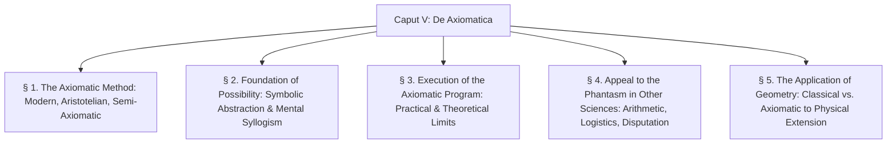

> [← Caput IV Summary](../caput-4/caput-4-summary.md) | [Latin](caput-5.md) | [English](caput-5-en.md) | Summary | [Notes](translation-notes-caput-5.md) | [Caput VI Summary →](../caput-6/caput-6-summary.md)

---

# CHAPTER SUMMARY & ANALYTICAL OUTLINE: CAPUT V

**Work:** Petrus Hoenen, S.J., *De Noetica Geometriae: Origine Theoriae Cognitionis* (Rome: Gregorian University Press, 1954)  
**Chapter:** Caput V: *De Axiomatica* (pp. 157–196)  

---

## Executive Summary

In Caput V, Father Petrus Hoenen presents a profound philosophical critique of the **axiomatic method in the modern sense** (David Hilbert, Bertrand Russell, Alfred North Whitehead), confronting it with the classical Aristotelian-Thomistic theory of demonstrative science (*Analytica Posteriora*).

Hoenen dismantles the formalist claim that geometry can be constructed as a purely autonomous, de-semanticized deductive system operating without intuition (*ohne Anschauung*). He demonstrates that:
1. **The Foundation of Axiomatics is Symbolic Abstraction:** Pure formal deduction is valid only because the human intellect possesses the natural capacity to abstract formal consequence (*consequentia*) from material meaning, using "transcendent terms" (schematic letters).
2. **The Syllogism is Natural and Intuitive:** Reasoning is not the mechanical execution of extrinsic rules, but the vital, intuitive operation of the intellect discerning necessary connections between objective states of affairs (*dispositiones rei*, *Sachverhalte*).
3. **The Practical and Theoretical Failure of Pure Axiomatics:**
   - *Practically:* A purely formal deduction of complete geometry without intuition generates an unmanageable explosion of syntactic verbosity that surpasses human mental capability.
   - *Theoretically:* Key axioms of order, connection, and topology (such as Hilbert’s Theorems 5 and 6 on the linear order of points) cannot be formulated or applied without direct appeal to the **spatial phantasm** of written symbols arranged on a page. Hilbert does not formalize geometry into logic; he smuggles geometric intuition into logic itself.
4. **The Ubiquity of the Phantasm in Non-Geometric Sciences:** Even in arithmetic equation-solving ($ax^2 = bx + c$) and symbolic logistics (substitution in *Principia Mathematica* *2.01), every single deductive transition relies upon a mental syllogism of "type *Barbara*" whose minor premise is an immediate proposition verified by **empirical manipulation and spatial inspection of symbols in the phantasm**.
5. **The Failure of Axiomatics in Physical Application:** Axiomatic geometry cannot be directly applied to physical bodies without creating an "infinite discrepancy" (since physical bodies terminate at discrete atomic/sensory minima, while geometry assumes infinite divisibility). Application is possible only by returning to classical formal abstraction, which grasps intelligible continuous extension within sensible reality.

---

## Detailed Section-by-Section Outline

### § 1. On the Axiomatic Method (pp. 157–164)
- **1. Axiomatics Strictly So Called (Modern Axiomatics):** Pure logical deduction from an established system of first propositions (axioms), where geometric terms (point, line, plane) are treated as uninterpreted tokens whose meaning is assumed unknown. Truth of premises is bracketed; only deductive correctness and immunity from internal contradiction are sought.
- **2. Aristotle's Method:**
  - Distinction between *understanding* (*intellectus*, νοῦς)—the habit of first principles—and *science* (*scientia*, ἐπιστήμη)—the habit of demonstrated conclusions.
  - Aristotle demands not merely formal consistency, but the **necessary truth** of premises (*demonstratio potissima*). Terms must be understood (*intellectis terminis*).
- **3. Semi-Axiomatics (Hans Freudenthal, Ferdinand Gonseth):**
  - An intermediate proposal: A prior science ("pre-geometry", "doctrine préalable", or "noetics") establishes the axioms with intuitive geometric meaning.
  - However, semi-axiomatics demands that once the axioms are formulated, all further appeal to intuition (*appellatio ad phantasma*) be forbidden to ensure absolute deductive rigor. Hoenen sets out to prove this demand is both practically and theoretically impossible.

---

### § 2. On the Foundation of the Possibility of Axiomatics (pp. 164–173)
- **1. The Syllogism Expressed in Words:**
  - *Symbolic Abstraction:* The mind easily distinguishes the truth of propositions from the validity of formal consequence (*consequentia*).
  - Medieval logic recognized this by substituting "transcendent terms" ($A, B, C$) for material words (St. Albert the Great, Pseudo-Thomas).
  - *Two Essential Conditions:*
    1. The terms must have a meaning (even if unknown), capable of functioning as subject and predicate.
    2. The propositional structure (order and function of subject, predicate, and middle term) must be known.
- **2. The Mental and Verbal Syllogism from a Noetic Perspective:**
  - *Syllogizing is Intuitive:* The intellect intuits that from two objective states of affairs (*dispositiones rei*, *Sachverhalte*), a third necessarily follows.
  - *Syllogizing is Natural:* The syllogism is an act of the rational nature of the intellect, not an extrinsic rule. Rebuttal of John Locke's quip ("God did not make men barely two-legged creatures and leave it to Aristotle to make them rational"): Aristotle did not invent logic; he analyzed the living activity of the mind.
  - *Logica Utens vs. Logica Docens:* Logic in use is the living form within a concrete science; theoretical logic is the reflexive science of these forms. Logical laws are **noetic laws** governing the objective structures of being (*Denkgesetze sind Gesetze des Gedachten*, Alois Riehl).

---

### § 3. On the Execution of the Axiomatic Program (pp. 173–182)
- **1. Preliminary Remarks:**
  - The twin requirements of axiomatics: **consistency** (freedom from contradiction) and **completeness**.
  - Rebuttal of the logistic interpretation of *"ex absurdo sequitur quodlibet"*: In medieval logic, this referred to formal consequence yielding both true and false propositions, not Russellian material implication where absurdity implies any arbitrary proposition.
- **2. Intrinsic Difficulties:**
  - **A) Practical Difficulty:**
    - Carrying out a complete formal deduction of geometry exceeds human mental power.
    - Hilbert's proof of Theorem 5 (linear order of four points on a line) occupies two full pages of intricate syntax.
    - Cites G. H. Hardy: *"I believe the prime Number Theorem because of de la Vallée-Poussin's proof of it, but I do not believe that $2 + 2 = 4$ because of the proof in Principia Mathematica."*
  - **B) Theoretical Difficulty:**
    - Deductions in geometry involve relational and topological propositions that cannot proceed without constant appeal to the phantasm.
    - *Textual Analysis of Hilbert's Theorem 6 (Order of $n$ points):* Hilbert's formulation relies upon the terms "on the one hand" (*einerseits*), "on the other hand" (*andererseits*), and "inverse" (*umgekehrt*). These terms are not formal logical operators; their meaning is derived entirely from the visual inspection of a linear row of letters on a page!
    - **Crucial Finding:** Hilbert does not reduce geometry to logic; **he smuggles geometric intuition into logic itself**. The linear sequence of written symbols on paper is an extended physical entity possessing spatial direction and betweenness.
    - Rebuttal of the claim of completeness: It is impossible to establish a system of axioms that renders all subsequent appeal to geometric intuition superfluous.

---

### § 4. On the Appeal to the Phantasm in Other Sciences (pp. 182–192)
- **1. General Principle:**
  - Man in this life cannot think without a phantasm (*nihil potest mens nostra intelligere sine phantasmate*). Even symbolic logic relies upon spatial-geometric phantasms of written symbols.
- **2. In Establishing First Principles:**
  - Contact, localization, motion of rigid bodies, and time all require intuitive abstraction from extension as the principle of individuation.
- **3. In Scientific Deduction:**
  - **A) In Arithmetic and Algebra:**
    - Transforming $ax^2 = bx + c$ into $ax^2 - bx - c = 0$ is governed by a mental syllogism of **type *Barbara***:
      - *Major:* Every equation resulting by term-transposition from a valid equation is valid.
      - *Minor:* Equation (2) results by term-transposition from equation (1).
      - *Conclusion:* Equation (2) is valid.
    - The minor premise is known not by deduction, but by **empirical manipulation of written marks accompanied by an intellectual intuition of necessity**.
  - **B) In Symbolic Logic / Logistics:**
    - Analysis of the first proof in Russell & Whitehead’s *Principia Mathematica* (*2.01, substituting $\sim p$ for $p$ in $p \lor p \supset p$).
    - The logistician knows the resulting formula only by physically writing and visually inspecting symbols in space.
    - The step is validated by a syllogism of type *Barbara*, proving that logisticians use the very syllogism they ridicule.
  - **C) In Other Sciences and the Scholastic Disputation:**
    - The Scholastic *"distinguo"* restores deductive rigor not by discarding meaning, but by reviving the intuitive intellectual grasp of the essence.
    - Verbal formulation serves as an indispensable tool: it stabilizes vague intuitions into fixed, enduring formulas, freeing the mind for further discovery.

---

### § 5. On the Application of Geometry (pp. 192–196)
- **A) Application of Classical Geometry:**
  - Classical geometry applies seamlessly to physical reality (Newtonian mechanics, optics, astronomy) because it was originally abstracted from physical extension. Physical measurements are recognized as approximations to exact geometric limits.
- **B) The Breakdown of Axiomatics in Physical Application:**
  - Axiomatic geometry, as a pure manipulation of uninterpreted tokens, cannot be applied to nature without assigning material meanings to its terms.
  - When assigned physical meanings, it encounters the **problem of exactitude**:
    - The geometric axiom states that between any two points there is a third (infinite divisibility).
    - Physical bodies terminate at discrete atomic, quantum, or sensory thresholds (*minima sensibilia*).
    - Direct application yields an **infinite discrepancy** between physical matter and axiomatic geometry.
  - Application is possible only by returning to classical formal abstraction: abstracting pure continuous extension as intelligible matter from physical bodies.
- **Conclusion:** Without noetics, modern axiomatics is an aristocratic, self-enclosed game with symbols (*ludus cum symbolis*). True science must remain grounded in the intellect's intentional contact with reality.

---

## Thematic Glossary of Key Terms

| Latin Term | English Translation | Philosophical & Mathematical Definition |
| :--- | :--- | :--- |
| *Axiomatica stricte dicta* | Axiomatics strictly so called | Modern formal axiomatics (Hilbert), which deduces theorems from uninterpreted tokens without regard to truth or intuitive meaning. |
| *Semi-axiomatica* | Semi-axiomatics | The position (Freudenthal, Gonseth) that allows intuition to establish axioms in "pre-geometry," but strictly forbids all subsequent appeal to intuition in deduction. |
| *Dispositio rei* (Sachverhalt) | State of affairs | The objective condition or alignment of things in reality to which the true judgment conforms and between which the syllogism intuits necessary consequence. |
| *Actus exercitus* | Act in exercise (exercised act) | The spontaneous, vital execution of a mental operation (e.g., reasoning in *Barbara*) without explicit reflection upon the formal rule. |
| *Actus signatus* | Act in sign (signified act) | The formal, reflexive enunciation of a mental rule or proposition. |
| *Logica utens* | Logic in use | Natural logic concretely embedded as the living form of an actual subject matter or science. |
| *Logica docens* | Taught / Theoretical logic | The theoretical science that abstracts from all material content to codify the formal laws of reasoning. |
| *Termini transcendentes* | Transcendent terms | Schematic formal symbols ($A, B, C$) that abstract from all determinate matter to represent pure logical relations. |
| *Appellatio ad phantasma* | Appeal to the phantasm | Recourse to sensory or imaginative representations (including written symbols on a page) accompanied by intellectual intuition. |
| *Approximationsmathematik* | Approximation mathematics | The application of exact geometry to physical reality, where empirical measurements are understood as approximations to exact intelligible limits (Felix Klein). |

---

> [← Caput IV Summary](../caput-4/caput-4-summary.md) | [Latin](caput-5.md) | [English](caput-5-en.md) | Summary | [Notes](translation-notes-caput-5.md) | [Caput VI Summary →](../caput-6/caput-6-summary.md)
