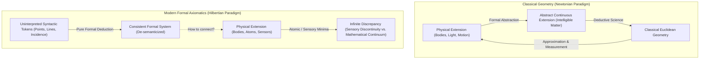

# TRANSLATION NOTES & SCHOLARLY COMMENTARY: CAPUT V

> [Latin Text](caput-5.md) | [English Translation](caput-5-en.md) | [AI Summary](caput-5-summary.md) | [**Translation Notes**](translation-notes-caput-5.md) | [Conspectus Totius Operis](../index.md)

---
**Work:** Petrus Hoenen, S.J., *De Noetica Geometriae: Origine Theoriae Cognitionis* (Rome: Gregorian University Press, 1954)  
**Chapter:** Caput V: *De Axiomatica* (pp. 157–196)  
**Translator / Epistemological Commentary:** Antigravity (Advanced Agentic Assistant, DeepMind / Geometor Project)  
**Date:** October 2026  

---

## 1. Context and Strategic Significance of Caput V

In Caput V, Father Petrus Hoenen mounts a sustained, rigorous philosophical critique of **modern mathematical axiomatics**—the formalist paradigm established by David Hilbert in his *Grundlagen der Geometrie* (1899) and codified by Bertrand Russell and Alfred North Whitehead in *Principia Mathematica* (1910–1913).

While contemporary philosophers of mathematics frequently treated Hilbertian formalism and symbolic logistics as having rendered classical epistemology obsolete, Hoenen reverses the critique:
1. He demonstrates that modern axiomatics is epistemologically incomplete without an underlying noetics.
2. He shows that the claim that formal deduction proceeds independently of all intuition (*ohne Anschauung*) is a psychological and operational illusion.
3. He reveals that even the most abstract logistic derivations (such as substitution in *Principia Mathematica*) rely at every single step upon an **appeal to the phantasm** (*appellatio ad phantasma*)—specifically, the spatial-geometric inspection of written symbols arranged in linear order.
4. He proves that the formalist program cannot bridge the gap to physical reality without returning to classical Aristotelian-Thomistic formal abstraction (*abstractio formalis intuitiva*).

---

## 2. Philological & Conceptual Analyses

### 2.1. *Dispositio Rei* and *Sachverhalt* (State of Affairs)
- **Latin:** *Dispositio rei*.
- **German Equivalent:** *Sachverhalt*.
- **English Translation:** "Disposition of the thing" / "state of affairs."
- **Context:** In footnote 4 (referencing his earlier work *Théorie du jugement*, 1946/1953, Ch. II, § 5), Hoenen connects St. Thomas Aquinas's phrase *dispositio rei* (*In IX Metaph.*, lect. 11; *ST* I, q. 16, a. 1–2) to the modern phenomenological and logical concept of *Sachverhalt* (developed by Alexius Meinong, Edmund Husserl, and Ludwig Wittgenstein).
- **Noetic Significance:** The judgment is not merely an association of concepts in the mind; it is an intentional assertion conforming to an objective *state of affairs* in reality. The syllogism intuits that from two objective states of affairs, a third necessarily obtains.

### 2.2. *Actus Exercitus* vs. *Actus Signatus*
- **Latin:** *Actus exercitus*; *actus signatus*.
- **Translation:** "Act in exercise" (exercised act) vs. "act in sign" (signified/explicit act).
- **Scholastic Background:** A distinction fundamental to medieval grammar and logic (Peter of Spain, Cajetan, John of St. Thomas):
  - *Actus exercitus:* The vital execution of an operation in act, without formal reflection upon the rule governing it (e.g., when a person reasons correctly in *Barbara* without knowing syllogistic figures).
  - *Actus signatus:* The reflexive, formal enunciation of the rule or structure itself (e.g., formulating the major premise "Every $B$ is $A$").
- **Application in Caput V:** Hoenen proves that when a mathematician solves an equation or a logistician performs a substitution, the mind is guided *in actu exercito* by a mental syllogism of type *Barbara*. The noeticist does not artificially impose this syllogism; he merely brings it from *actus exercitus* into *actus signatus*.

### 2.3. *Logica Utens* vs. *Logica Docens*
- **Latin:** *Logica utens* (logic in use); *logica docens* (taught/theoretical logic).
- **Source:** St. Thomas, *In IV Metaph.*, lect. 4, no. 577; *In Boeth. de Trin.*, q. 6, a. 1.
- **Meaning:**
  - *Logica utens:* Natural logic concretely embedded in the subject matter of an actual science. It is the living form of the demonstrative discourse.
  - *Logica docens:* The theoretical science of logic that abstracts from all material content and treats of the formal rules of consequence in the abstract.
- **Hoenen's Insight:** Theoretical logic is not a set of extrinsic, tyrannical decrees imposed upon thought; it is the reflexive codification of the vital laws of natural logic (*logica utens*), which in turn are grounded in the intelligible structures of being (*Denkgesetze sind Gesetze des Gedachten*, Alois Riehl).

### 2.4. *Species Individua* / *Species Specialissima*
- **Latin:** *Species individua*; *species specialissima*.
- **Translation:** "Individual species" / "lowest species."
- **Context:** In Aristotelian-Scholastic logic (Porphyry's *Isagoge*), the *species specialissima* is the infima species below which there are no further specific differences, but only numerically distinct individuals.
- **Application:** In algebraic and logistic operations, the intermediate propositions (such as the minor premise verifying that $ax^2 - bx - c = 0$ results from transposing terms in $ax^2 = bx + c$) are universal propositions within an *individual species*: they hold universally for any instance of that exact syntactic equation.

---

## 3. Key Historical and Philosophical Debates

### 3.1. The Hoenen–Freudenthal Controversy (*Gregorianum*, 1951)
In footnote 2, Hoenen cites his debate with the renowned Dutch mathematician and historian of science **Hans Freudenthal** (1905–1990):
- **Freudenthal’s Proposal ("Semi-Axiomatics"):** Freudenthal argued in *Gregorianum* (1951, pp. 425–433) that geometric intuition belongs strictly to an initial "pre-geometry" (*praegeometria*). There, the geometer abstracts axioms from physical reality. But once the axioms are established, all further appeal to intuition must be ruthlessly banished. To admit any subsequent appeal to the phantasm would destroy the logical rigor of mathematics.
- **Hoenen’s Refutation:** Hoenen shows that semi-axiomatics is impossible both practically and theoretically:
  1. *Practically:* A purely formal deduction of geometry without intuition creates an unmanageable explosion of syntactic verbosity that surpasses human mental capacity (as shown by Hilbert's 2-page proof of the order of four points).
  2. *Theoretically:* The geometer cannot even understand the formal axioms of order and connection without inspecting the linear, spatial arrangement of symbols on paper. Semi-axiomatics merely sweeps intuition under the rug, turning conscious intellective abstraction into unacknowledged, tacit assumption.

### 3.2. David Hilbert and the Smuggling of Spatial Intuition in the *Grundlagen*
In § 3, no. 2 B, Hoenen subjects Hilbert's *Grundlagen der Geometrie* (7th ed., 1930) to a devastating textual and noetic critique:
- **Theorem 5 & Theorem 6:** In Theorem 6 (pp. 8–9), Hilbert claims to establish the linear order of $n$ points on a straight line purely from axioms of order.
- **The Textual Smoking Gun:** Hilbert's theorem cannot even be stated without introducing undefined, intuitive concepts: *"einerseits"* ("on the one hand") and *"andererseits"* ("on the other hand"), and *"die umgekehrte"* ("the inverse arrangement").
- **Hoenen's Discovery:** The relation "between" ($B$ lies between $A$ on the one hand and $C, D, E$ on the other) is explained by Hilbert by displaying a linear horizontal diagram of dots and letters ($A$—$B$—$C$—$D$—$E$—$K$). The meaning of "on the one hand" and "on the other hand" is **purely spatial and geometric**!
- **Conclusion:** Hilbert does not formalize geometry into uninterpreted logic; rather, **he smuggles geometric intuition into logic itself**. The linear sequence of written symbols on a sheet of paper is an extended physical entity possessing spatial direction, order, and betweenness.

### 3.3. Bertrand Russell, Logistics, and the Apotheosis of Stupidity
- **Russell's Contempt for the Syllogism:** In *Principles of Mathematics* and popular essays, Bertrand Russell repeatedly ridiculed Aristotelian logic, calling the traditional syllogism trivial, sterile, and the "apotheosis of stupidity" because all mathematical reasoning supposedly transcends subject-predicate logic.
- **Hoenen's Rebuttal via *Principia Mathematica* (*2.01):**
  Hoenen analyzes the very first proof in *Principia Mathematica* (Vol. I, p. 100), theorem *2.01:
  $$\vdash : p \supset \sim p . \supset . \sim p$$
  The proof consists in substituting $\sim p$ for $p$ in the tautology axiom *1.2:
  $$p \lor p . \supset . p$$
  yielding:
  $$\sim p \lor \sim p . \supset . \sim p$$
  Hoenen asks: **How does the logistician know that this string of ink marks results from that substitution?**
  1. The general rule of substitution gives only the abstract permission to substitute.
  2. The actual resulting formula is obtained by **physically manipulating and visually inspecting symbols in space**.
  3. The mental act affirming the validity of the step is a **syllogism of type *Barbara***:
     - *Major:* Every formula resulting by legitimate substitution from a valid thesis is valid.
     - *Minor:* Formula (1) results by legitimate substitution of $\sim p$ for $p$ in thesis *1.2.
     - *Conclusion:* Formula (1) is valid.
  4. Thus, Russell and Whitehead cannot advance a single step in their formal logistics without employing the very syllogism they mocked, and without appealing to the spatial phantasm of written marks on a page!

### 3.4. G. H. Hardy on Hilbert and *Principia Mathematica*
Hoenen makes brilliant use of G. H. Hardy's classic 1929 paper in *Mind* ("Mathematical Proof"):
1. **On the Credibility of Formal Proofs:** Hardy remarked that he believed the Prime Number Theorem because of Charles-Jean de la Vallée Poussin's analytical proof, but he did *not* believe that $2 + 2 = 4$ because of the tortuous 300-page proof in *Principia Mathematica*. Formal logistic deduction does not generate conviction for elementary truths; intuition does.
2. **On the Invariance of Mathematical Reality:** Hardy pointed out that if Hilbert writes mathematics in pencil on one sheet of paper, and Hardy copies it in red ink on another sheet, it is identical mathematics. Hoenen uses this to demonstrate **formal abstraction**: the intellect abstracts the essential mathematical relation from the accidental material medium (graphite vs. red ink).

### 3.5. John Locke and the Rationality of Man
In § 2, no. 2 B, Hoenen cites John Locke's famous quip in *An Essay Concerning Human Understanding* (Bk. IV, ch. 17, § 4):
> *"God has not been so sparing to men to make them barely two-legged creatures, and left it to Aristotle to make them rational."*

Hoenen embraces Locke's insight while rejecting his anti-syllogistic conclusion:
- Locke was right that man reasons naturally before studying logic.
- But Aristotle did not invent logic as an artificial straightjacket; he discovered the natural, vital laws of the rational mind (*physic* of the intellect). The syllogism is the living pulse of human rationality.

---

## 4. The Epistemological Impasse: Applying Axiomatics to Physical Reality

In § 5, Hoenen delivers his crowning critique regarding the **application** of geometry to the physical world:

### The "Infinite Discrepancy"
- If modern axiomatics claims that its terms are pure uninterpreted symbols, it cannot be applied to nature without interpreting those symbols.
- If it interprets them as physical entities, it encounters a fatal problem:
  - Axiom of density: *Between any two points on a line, there exists a third point.*
  - Physical reality: Any physical line terminates at discrete atomic or quantum thresholds, or at the *minimum sensibile* of perception.
  - A physical line is **not** infinitely divisible in act; it cannot verify the axiom of continuity.
- Therefore, there is an **infinite discrepancy** between the physical body and the axiomatic system.
- To resolve this discrepancy, the physicist must do what classical philosophy always did: **abstract the notion of pure continuous extension** from matter, recognize it as intelligible matter, and realize that physical measurements are *approximations* to ideal geometric boundaries.
- **Final Verdict:** Modern axiomatics, when severed from noetics, is an aristocratic, self-enclosed game with symbols (*ludus cum symbolis*). To become a true science of the physical cosmos, it must inevitably return to the Thomistic noetics of geometry.

---

> [Latin Text](caput-5.md) | [English Translation](caput-5-en.md) | [AI Summary](caput-5-summary.md) | [**Translation Notes**](translation-notes-caput-5.md) | [Conspectus Totius Operis](../index.md)
