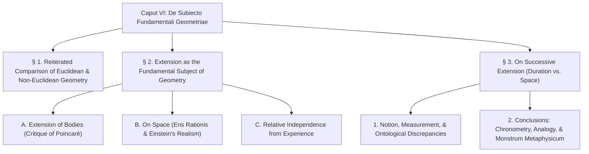
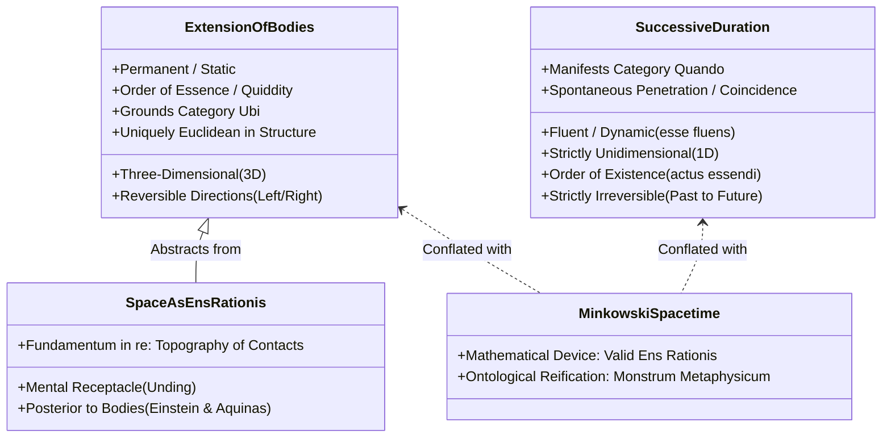

# CHAPTER SUMMARY & ANALYTICAL OUTLINE: CAPUT VI

> [Latin](caput-6.md) | [English](caput-6-en.md) | Summary | [Notes](translation-notes-caput-6.md) | [Table of Contents](../index.md)

---
**Work:** Petrus Hoenen, S.J., *De Noetica Geometriae: Origine Theoriae Cognitionis* (Rome: Gregorian University Press, 1954)  
**Chapter:** Caput VI: *De Subiecto Fundamentali Geometriae* (pp. 195–222)  

---

## Executive Summary

In Caput VI, Father Petrus Hoenen investigates the **fundamental ontological subject** of geometry. Departing from prevailing modern views that treat geometry as the science of "space" (conceived either as an absolute receptacle, a subjective intuition, or an arbitrary conventional coordinate system), Hoenen establishes a rigorous realist noetics:

1. **The True Subject is Corporeal Extension:** Geometry is not the science of empty space, but the science of the **extension of real bodies**. Space is conceptually and ontologically posterior to extended bodies.
2. **Euclidean Structure is Uniquely Fundamental:** Non-Euclidean geometries represent mathematical structures with non-zero curvature, but the Euclidean structure (zero curvature, isotropic continuum of directions) is the **uniquely fundamental structure** of extension as such.
3. **Refutation of Poincaré's Conventionalism:** Against Henri Poincaré’s claim that geometry merely defines relations of bodies to space, Hoenen demonstrates that geometric properties (such as figurability and divisibility) are known by **intuitive formal abstraction** directly from the extension of bodies, completely independently of any prior notion of space.
4. **Einstein's Independent Rediscovery of Aquinas:** Hoenen shows that Albert Einstein (in *Forum*, 1930) arrived at the classical Thomistic doctrine: *Bodies are known first; spatial relations (mutual contacts) second; and the concept of space only third as a derived mental construct.*
5. **Autonomy of the Intellect over Sensibility:** Geometry depends on experience only to provide the material object (the phantasm). Once presented, the intellect judges with autonomous authority, grasping necessary connections and exact boundaries that surpass the fuzzy, inexact data of sense perception.
6. **Permanent vs. Successive Extension (Space vs. Time):** Hoenen articulates a foundational metaphysical distinction between:
   - **Permanent Extension:** Static, three-dimensional, belonging to the order of **essence/quiddity**, directionally reversible.
   - **Successive/Fluent Extension (Duration):** Dynamic, strictly unidimensional, belonging to the order of **existence** (*esse fluens*), strictly irreversible (*quod factum est infectum fieri nequit*).
7. **Demolition of the 4D Spacetime Ontology:** Treating Minkowski's 4D chronotope as a literal physical reality positing time as a fourth geometric dimension is a **"metaphysical monster"** (*monstrum metaphysicum*). Spacetime is valid as a calculating device (*ens rationis cum fundamento in re*), but ontologically absurd if reified.

---

## Detailed Section-by-Section Outline

---

### § 1. Reiterated Comparison of Euclidean and Non-Euclidean Geometry (pp. 195–200)

- **1. Clarification Against *Gregorianum* Reviewers:**
  - Hoenen corrects a mischaracterization of his view (cf. *Gregorianum*, 1951): Euclidean geometry is not merely "more probable" than non-Euclidean geometries; it is **uniquely fundamental**, because it expresses the undeformed structure of extension as such.
- **2. Postulate V and the Continuum of Directions:**
  - Euclid's Fifth Postulate and Proposition 30 guarantee that around every point in extension, there exists **specifically the same continuum of directions** (homogeneity / isotropy).
  - An extension verifying Postulate V is isotropic; conversely, an extension having an isotropic continuum of directions necessarily verifies Postulate V.
- **3. Curvature in the Intuitive Sense:**
  - Non-Euclidean geometries introduce constant positive or negative curvature, removing the specific identity of directional continua.
  - Curvature is not a mere algebraic coefficient; it has an **intuitive geometric meaning** rooted in the behavior of directional sheaves through points.
  - The fundamental subject of geometry is therefore **the structures of extension**, among which the Euclidean structure (curvature = 0) is the ground and benchmark of all others.

---

### § 2. On Extension as the Fundamental Subject of Geometry (pp. 200–213)

#### A. On the Extension of Bodies (pp. 200–204)
- **1. Critique of Henri Poincaré (*La science et l'hypothèse*):**
  - Poincaré argues that measuring a physical circle tests only the properties of matter and measuring rods, not "space," concluding that geometric properties are arbitrary relations of bodies to space.
  - Hoenen replies: The experiment does bear on bodies, but on a unique, necessary property: **extension**.
- **2. The Operative Definition of Geometric Properties:**
  - When we divide a body, we understand that it is **figurable**, and that this figurability flows *uniquely and necessarily* from extension (not color, weight, or temperature).
  - Contrasted with physical properties (e.g., electrification through friction in amber, ἤλεκτρον), which are contingent facts known only by observation without intrinsic intelligibility.

#### B. On Space (pp. 204–208)
- **1. Ontological Priority:** Real extended bodies are prior to place, and prior to any concept of "space."
- **2. The Topography of the Universe:**
  - Bodies touch, establish mutual contacts, and create intermediate distances.
  - The composite system of contacts forms the topography of the cosmos.
  - Calling this topography "space" is legitimate only if understood as the extension of a vast composite bodily system.
- **3. Space as an *Ens Rationis cum Fundamento in Re*:**
  - Imagining an empty container that remains after all bodies are destroyed is an *ens rationis* (Kant's *Unding*).
  - Real bodies do not derive their properties from space; rather, spatial concepts derive their validity from real bodies.
- **4. Albert Einstein's Realist Discovery (*Forum*, 1930):**
  - Einstein independently confirms St. Thomas Aquinas:
    $$\text{Extended Bodies} \longrightarrow \text{Mutual Contacts (Spatial Relations)} \longrightarrow \text{Concept of Space}$$
  - Space without bodies is an empty abstraction.

#### C. On the Relative Independence of the Notion of Extension from Experience (pp. 208–213)
- **1. Autonomy of Intellective Intuition:**
  - The senses present the material fact; the intellect intuits **necessity** and **exactitude**.
  - *Mental Experiments:* In geometry, we can construct and divide figures validly in pure imagination (a body is figurable because extended). In physics, imagining a copper rod attracting paper leads to error.
- **2. Correction of the Phantasm:**
  - A line drawn in imagination always has sensible breadth; yet the intellect judges with certainty that a true boundary has *zero breadth*. The intellect transcends sensory limitations.
- **3. Universal Invariance Across Scales:**
  - Physical laws (e.g., Newton's inverse-square gravity) are empirical approximations that may break down at subatomic or cosmic scales.
  - Geometric laws (e.g., spherical area $\propto r^2$) **hold with absolute exactitude at all scales**, because continuous extension is intelligible through itself and infinitely divisible in principle.

---

### § 3. On Successive Extension (pp. 213–222)

#### 1. On the Notion Itself and Its Proper Attributes (pp. 213–219)
- **Two Kinds of Extension:**
  - *Permanent / Static Extension:* The 3D extension of bodies and trajectories (order of essence).
  - *Successive / Fluent Extension:* The duration of motion (*esse fluens*, order of existence).
- **Aristotle's Theory of Measurement (*Metaphysics* X):**
  - Unit of measure (μέτρον) must be connatural and homogeneous (συγγενές) with the measured quantity (ᾧ τὸ ποσὸν γιγνώσκεται).
  - Measurement reveals an already existing quantitative magnitude; it does not invent it.
- **Discrepancies Between Space and Duration:**
  1. *Ontological:* Space is essence/quiddity; duration is pure existential act (*actus essendi*).
  2. *Dimensionality:* Space is 3D (surfaces 2D, lines 1D); duration is **strictly 1D** (multi-dimensional duration is an absurdity).
  3. *Directionality:* A line has two opposite directions (Athens $\leftrightarrow$ Thebes); duration is **strictly irreversible** (past $\to$ future; *quod factum est infectum fieri nequit*).
  4. *Angles and Sheaves:* Lines form angles and directional sheaves; durations cannot form angles.
  5. *Contact and Penetration:* Measuring lines requires physical alignment; simultaneous durations **spontaneously penetrate and coincide**.
  6. *Category:* Bodies can be moved and rearranged in space (category *Ubi*); temporal order cannot be rearranged (**no motion in the category *Quando***).

#### 2. Conclusions (pp. 219–222)
- **A) Exactitude in Chronometry:**
  - Neo-positivist operationalism relies upon the *principle of specific chronometric indifference* (equal oscillations have equal duration under equal conditions).
- **B) A Unique Specimen of Analogy:**
  - Static and fluent extension are analogous, but unlike classical Scholastic analogies, we possess a **proper concept** of both: one in the order of essence, one in the order of existence.
- **C) The Chronotope and the "Metaphysical Monster":**
  - Evaluating Hermann Minkowski’s 4D spacetime:
  - As a mathematical calculating device (*ens rationis cum fundamento in re*), spacetime is admissible and useful.
  - As a literal ontological claim that time is a fourth physical dimension of a static continuum: **"a metaphysical monster is posited"** (*ponitur monstrum metaphysicum*).

---

## Thematic Architecture of Caput VI

---

## Conceptual Glossary of Latin Terms

- **Subiectum fundamentale:** The primary ontological subject of a science (here, the extension of real bodies).
- **Extensio permanens:** Static extension existing simultaneously in three dimensions; determination of essence.
- **Extensio fluens / successiva:** Dynamic extension flowing successively in time; determination of existence (*duration*).
- **Ens rationis cum fundamento in re:** A conceptual construct that does not exist extramentally as an independent entity, but is objectively grounded in real relations among actual beings.
- **Quod factum est infectum fieri nequit:** "What is done cannot be undone"—the metaphysical principle of the absolute irreversibility of temporal duration.
- **Monstrum metaphysicum:** A metaphysical monster—the absurd philosophical error of reifying a mathematical abstraction into an impossible physical reality (specifically, treating time as a fourth spatial dimension).
- **Motus in praedicamento quando:** Motion in the category *when*—which Aristotelian philosophy proves is impossible; events cannot be reordered or revisited.
- **Μέτρον (metron) / Συγγενές (syngenes):** Aristotle's terms for the measuring unit and its requirement of essential homogeneity with the measured quantity.

---

> [Latin](caput-6.md) | [English](caput-6-en.md) | Summary | [Notes](translation-notes-caput-6.md) | [Table of Contents](../index.md)
