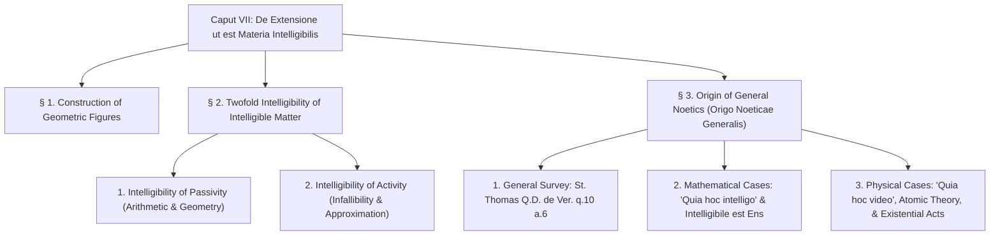
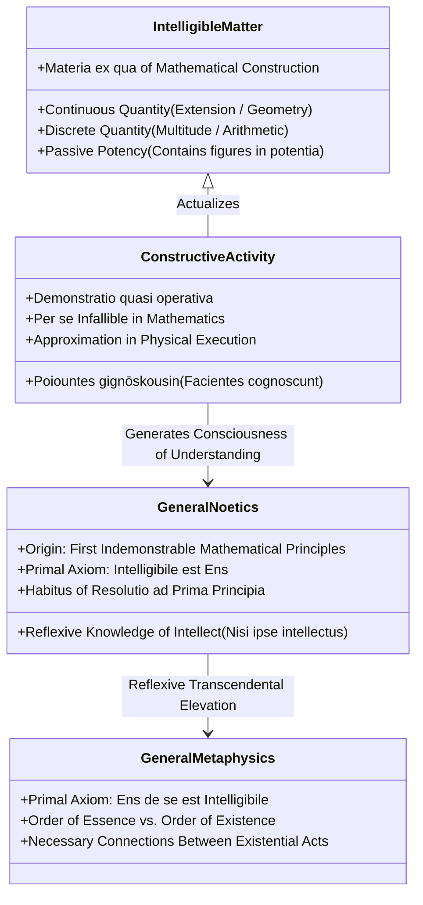

> [← Caput VI Summary](../caput-6/caput-6-summary.md) | [Latin](caput-7.md) | [English](caput-7-en.md) | Summary | [Notes](translation-notes-caput-7.md) | [Appendix Summary →](../appendix/appendix-summary.md)

---

# CHAPTER SUMMARY & ANALYTICAL OUTLINE: CAPUT VII

**Work:** Petrus Hoenen, S.J., *De Noetica Geometriae: Origine Theoriae Cognitionis* (Rome: Gregorian University Press, 1954)  
**Chapter:** Caput VII: *De Extensione ut est Materia Intelligibilis* (pp. 223–248)  

---

## Executive Summary

Caput VII forms the crowning philosophical synthesis of *De Noetica Geometriae*. Having examined the problems of necessity, exactitude, modern axiomatics, and the ontology of extension, Father Petrus Hoenen unifies the entire work around a single grand thesis: **Mathematical cognition—specifically the intuitive formal abstraction of intelligible matter—is the true, indispensable origin of general epistemology (*origo noeticae generalis*) and general metaphysics.**

The key insights established in this chapter include:

1. **Geometry as a Constructive Science:** 
   - Geometry does not deal with pre-existing, static figures in act (refuting Bertrand Russell), nor does the human mind freely invent figures *ex nihilo* (refuting Kantian and formalist creationism).
   - Rather, figures pre-exist **in potency** within continuous extension as intelligible matter. Demonstrating the mathematical existence of a figure requires actualizing it through construction—a doctrine classical Thomism called **"quasi-operative demonstration"** (*demonstratio quasi operativa*), rooted in Aristotle's dictum: **ποιοῦντες γιγνώσκουσιν** (*poiountes gignōskousin*) / **"facientes cognoscunt"** ("in making they know", *Metaph.* IX, 9).
2. **The Twofold Intelligibility of Intelligible Matter:**
   - *Intelligibility of Passivity:* What intelligible matter can undergo (divisibility, addition, 1-to-1 correspondence, mutual contact, algebraic transposition).
   - *Intelligibility of Activity:* While the transeunt causal influx in physical nature is hidden, mathematical constructive activity is *per se infallible* and intelligible, because its operation directly mirrors the intelligible nature of the matter it shapes.
3. **The Genesis of Epistemological Realism:**
   - In accordance with St. Thomas (*Q.D. de Veritate*, q. 10, a. 6), all human science begins with first indemonstrable principles rooted in sensible experience.
   - The human mind first discovers **what understanding is** (*quid sit intelligere*) not by gazing inward into empty consciousness, but by intuiting necessary connections in external mathematical objects (*"quia hoc intelligo"* vs. *"quia hoc video"*).
4. **From Mathematics to Metaphysics:**
   - From the intuitive certainty that the understood disposition of the thing possesses objective reality arises the foundational axiom of noetics: **intelligibile est ens** ("the intelligible is being").
   - From its converse reflection arises general metaphysics: **ens de se est intelligibile** ("being of itself is intelligible").
5. **Physical Science and the Discrete Triumph of Atomic Theory:**
   - While physical laws are empirical generalizations that may break down at cosmic or subatomic scales (e.g., Newtonian gravity), the discrete sciences demonstrate the profound mathematical intelligibility of nature. 
   - The periodic table of chemical elements ($Z = 1, 2, 3, \dots, 92$) gloriously vindicates the ancient Aristotelian principle: **"species are like numbers"** (*species sunt sicut numeri*).
6. **The Bridge to Existential Acts:**
   - Intuitive abstraction grasps not only formal quiddities, but **necessary connections between existential acts**: *"This is moved, therefore it exists"* (*Hoc movetur ergo existit*); *"This is moved, therefore a moving cause exists"*; providing the direct theoretical runway for the treatise's Appendix.

---

## Detailed Section-by-Section Outline

---

### § 1. On the Construction of Geometric Figures (pp. 223–229)

- **1. The Hierarchy of Subjects in Demonstrative Science:**
  - In St. Thomas (*In I Anal. Post.*, lect. 2 & 15), every science has a primary "subject genus" (*genus subiectum*): in geometry, it is **magnitude / continuous extension**.
  - Primary divisions produce boundaries (surfaces, lines, points), which are primary proper attributes (*passiones*).
  - These boundaries become **secondary subjects** (triangles, squares, circles) whose own proper passions are demonstrated.
- **2. Construction as Demonstration of Mathematical Existence:**
  - Figures exist in extension **in potency only**.
  - Proving the mathematical existence of a figure means demonstrating that it can be constructed out of intelligible matter.
  - H. G. Zeuthen showed this was the foundational method of the ancient Greeks.
  - St. Thomas terms such proofs **"quasi-operative demonstrations"** (*demonstrationes quasi operativae*), anticipating modern operationalism (P. W. Bridgman).
- **3. Aristotle vs. Kantian and Formalist "Free Creation":**
  - Moderns follow Kant in viewing geometry as a "constructive science," but erroneously claim the mind creates objects *ex nihilo* by free fiat.
  - Rebuttal: The mind's constructive activity is bound by the intrinsic properties of extension.
  - Aristotle's principle: **ποιοῦντες γιγνώσκουσιν** (*poiountes gignōskousin*) / **"facientes cognoscunt"** ("in making they know", *Metaph.* IX, 9, 1051a32).
- **4. Straightedge and Compass (*Regula et Circinus*):**
  - Euclid's first three postulates legitimize elementary operations: drawing straight lines and describing circles.
  - Straightedge and compass are real physical approximations to ideal operations intelligible in pure extension.

---

### § 2. On the Twofold Intelligibility of Intelligible Matter (pp. 229–237)

#### 1. On the Intelligibility of Passivity (pp. 229–232)
Intelligible matter is divided into **discrete quantity** (multitude / arithmetic) and **continuous quantity** (extension / geometry). Both possess an immediately intelligible passivity (what they can undergo):

- **A) In Arithmetic (Discrete Quantity):**
  - *Divisibility:* Multitudes can be divided into units; the elements remain unchanged.
  - *Addition:* Multitudes can be combined into a greater whole.
  - *Comparison:* Establishing a one-to-one correspondence (*correspondentia bi-univoca*) reveals equality or inequality.
  - *Enumeration:* Coordinating a multitude with the natural number series detects its species ("counting on one's fingers").
  - *Combinatorics:* Permutations and spatial orderings of elements.
  - *Formulas:* Transposition of terms and substitution in algebra and logistics.
- **B) In Geometry (Continuous Quantity):**
  - *Division into Boundaries:* 3D solid $\to$ 2D surface $\to$ 1D line $\to$ 0D indivisible point.
  - *Principle of Individuation:* Congruent figures repeated across diverse sites.
  - *Mutual Contact:* Two extended bodies can share common boundaries (*tangi secundum limites*), generating composite systems, addition, and multiplication of magnitudes.
  - *Topography & Motion:* Local relations and local motion flow from mutual contact.

#### 2. On the Intelligibility of Our Activity (pp. 232–237)
- **The Causality Dilemma:** In physical nature, we understand the principle of causality (*omne quod movetur ab alio movetur*), but the transeunt causal influx itself is imperceptible.
- **Why Mathematical Activity is Intelligible:**
  - Because it operates directly on intelligible matter, the correspondence between the mental or physical operation and the resulting effect is **per se intelligible**.
  - *Arithmetic Activity:* Of itself **infallible** (counting is inherently certain; errors arise only *per accidens* from fatigue or distraction). Contrast with drawing marbles from an urn, where physical grasp is contingent.
  - *Geometric Activity:* Division produces exact boundaries in physical reality; drawing congruent figures suffers from sensory/instrumental inexactitude, but physical construction is understood as an intelligible **approximation** to the ideal construction.
  - *Contrast with Physical Activity:* In rubbing an amber rod, the geometric motion of friction is intelligible, but the electrical influx remains completely hidden.

---

### § 3. On the Origin of General Noetics (pp. 237–248)

#### 1. General Survey (pp. 237–239)
- **St. Thomas's Capital Axiom (*Q.D. de Veritate*, q. 10, a. 6):**
  > *"All our cognition originally consists in the knowledge of first indemonstrable principles. The cognition of these in us arises from sense... Therefore our science arises from sense."*
- **"To Understand is to Understand Something" (*Intelligere est intelligere aliquid*):**
  - The first object of intellection cannot be abstract thinking itself (which would cause an infinite regress).
  - It must be an external object presented by sense.
- **The Two Classes of Cognitions:**
  - *Mathematical Cases:* Affirmed **"because I understand this"** (*« quia hoc intelligo »*).
  - *Physical Cases:* Affirmed **"because I see this with my eyes"** (*« quia hoc video oculis »*).

#### 2. On Mathematical Cases (pp. 239–243)
- **The Experience of Understanding:** In mathematical cases, the mind first experiences what understanding actually is.
- **Intuitive Formal Abstraction:** The mind sees that figurability flows *uniquely and necessarily* from extension.
- **Superiority over Sensibility:** Intellect grasps **necessity** and **exactitude** despite the fuzzy, inexact, and necessitated phantasm.
- **The Birth of Noetics and Metaphysics:**
  $$\text{Mathematical Intuition} \longrightarrow \textbf{Intelligibile est Ens} \text{ (Noetics)} \longrightarrow \textbf{Ens de se est Intelligibile} \text{ (Metaphysics)}$$
- **Vindication of Aristotle:** Refutes modern critics who claimed Aristotelian abstraction cannot justify mathematical knowledge, reminding them that Aristotle called mathematical objects **τὰ ἐξ ἀφαιρέσεως** (*ta ex aphaireseōs*).
- **Resolution to First Principles (*Resolutio ad Prima Principia*):** Requires cultivation of an intellectual *habitus*.

#### 3. On Physical Cases (pp. 243–248)
- **Epistemological Contrast:**
  - In mathematics: from understood essence we infer *being* (*ipsum esse*).
  - In physics: from observed *being* we infer that the relation must have an intelligible cause.
- **Qualitative Exceptions:** Degrees of quality and intensities share an analogy with lines and fluent duration (alteration).
- **Mathematical Physics & Émile Meyerson:** Experimental science imitates mathematical abstraction (*« le mathématique se détache du fond du réel »*).
- **Invariance vs. Approximation:**
  - Physical formulas (e.g., Newton's inverse-square gravity) are empirical approximations that may break down at extremes.
  - Geometric laws (spherical area $\propto r^2$) **never fail at any scale**.
- **The Atomic Triumph:** 
  - Mendeleev and modern atomic numbers ($Z = 1, \dots, 92$) order chemical elements strictly by natural numbers!
  - Vindication of Aristotle's adage: **"species are like numbers"** (*« species sunt sicut numeri »*).
- **Connections Between Existential Acts (Bridge to Appendix):**
  - Intuitive abstraction extends beyond forms to **existential acts**:
    - *"I think, therefore I am"* (*Cogito ergo sum*).
    - *"This is moved, therefore it exists"* (*Hoc movetur ergo existit*).
    - *"This is moved, therefore a moving cause exists"* (*Hoc movetur ergo causa movens existit*).
    - *"Two bodies are in local relation, therefore they coexist simultaneously"* (*Duo corpora sunt in relatione locali ergo simul existunt*).

---

## Thematic Architecture of Caput VII

---

## Conceptual Glossary of Latin & Greek Terms

- **Materia intelligibilis (ὕλη νοητή):** Intelligible matter—continuous and discrete quantity abstracted from sensible qualities, serving as the substance of mathematical objects.
- **Genus subiectum:** The primary subject genus of a demonstrative science (magnitude in geometry, number in arithmetic).
- **Demonstratio quasi operativa:** A demonstration that proves mathematical existence by describing the physical or mental operation that constructs the figure.
- **Ποιοῦντες γιγνώσκουσιν (facientes cognoscunt):** Aristotle’s adage from *Metaphysics* IX, 9: "in making they know"—the intellect knows figures by actualizing their potentiality in extension.
- **Τὰ ἐξ ἀφαιρέσεως (ta ex aphaireseōs):** "Things from abstraction"—Aristotle’s classical designation for mathematical entities.
- **Intelligibile est ens:** "The intelligible is being"—the fundamental axiom of Thomistic noetics, proving that intelligible objects have objective, realistic being.
- **Ens de se est intelligibile:** "Being of itself is intelligible"—the fundamental axiom of general metaphysics.
- **Species sunt sicut numeri:** "Species are like numbers"—Aristotle's metaphysical adage vindicated in the discrete atomic numbers ($1 \dots 92$) of the periodic table.
- **Nisi ipse intellectus:** "Except the intellect itself"—the addition to the sensory adage made by St. Thomas (*De Malo*, q. 6) and later Leibniz.
- **Hoc movetur ergo existit:** "This is moved, therefore it exists"—the primary existential intuition demonstrating necessary connections between existential acts.

---

> [← Caput VI Summary](../caput-6/caput-6-summary.md) | [Latin](caput-7.md) | [English](caput-7-en.md) | Summary | [Notes](translation-notes-caput-7.md) | [Appendix Summary →](../appendix/appendix-summary.md)
