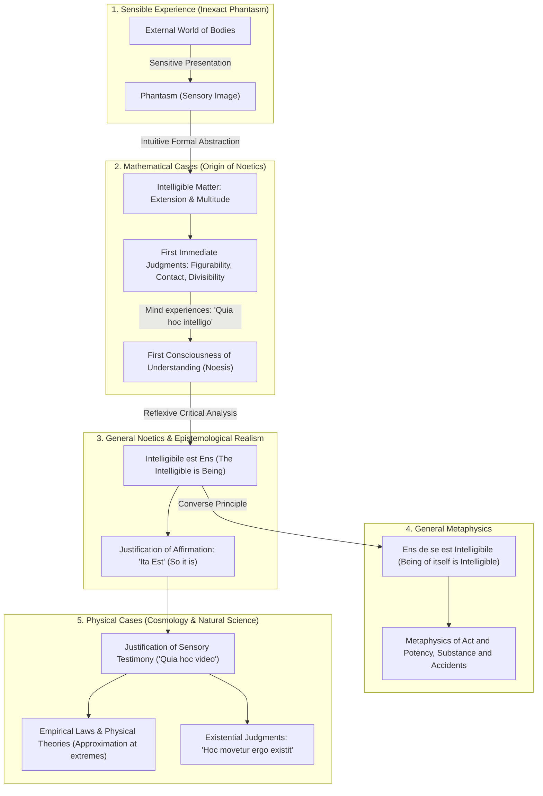

> [Latin](caput-7.md) | [English](caput-7-en.md) | [Summary](caput-7-summary.md) | Notes | [Table of Contents](../index.md)

---

# TRANSLATION NOTES & SCHOLARLY COMMENTARY: CAPUT VII

**Work:** Petrus Hoenen, S.J., *De Noetica Geometriae: Origine Theoriae Cognitionis* (Rome: Gregorian University Press, 1954)  
**Chapter:** Caput VII: *De Extensione ut est Materia Intelligibilis* (pp. 223–248)  
**Translator / Epistemological Commentary:** Antigravity (Advanced Agentic Assistant, DeepMind / Geometor Project)  
**Date:** October 2026  

---

## 1. Context and Strategic Significance of Caput VII

Caput VII constitutes the grand philosophical synthesis and theological-epistemological climax of the main text of *De Noetica Geometriae*. Having resolved the problem of necessity (Caput II), the problem of exactitude (Capita III & IV), the nature of formal axiomatics (Caput V), and the ontology of corporeal extension versus space and duration (Caput VI), Father Petrus Hoenen now achieves his ultimate architectural objective: **demonstrating that mathematical cognition is the foundational origin of general epistemology and metaphysics (*origo noeticae generalis*)**.

Hoenen's argument establishes:
1. **Mathematics is a Constructive Science Grounded in Intelligible Matter:** Long before Immanuel Kant claimed constructive mathematics as an idealist novelty, Aristotle and St. Thomas Aquinas taught that the geometer proves mathematical existence through **"quasi-operative demonstrations"** (*demonstrationes quasi operativae*).
2. **The Refutation of Mathematical Creationism:** Against modern nominalists and formalists who assert that mathematical entities are created *ex nihilo* by arbitrary mental decree, Hoenen proves that mathematical figures exist **in potency** within the fundamental subject (continuous extension). The mind does not invent them freely; it discovers and actualizes them out of intelligible matter: **ποιοῦντες γιγνώσκουσιν** (*poiountes gignōskousin*) / **"facientes cognoscunt"** ("in making they know", Aristotle, *Metaph.* IX, 9).
3. **The Twofold Intelligibility of Intelligible Matter:**
   - *Passivity:* What continuous extension and discrete multitude can undergo (division, addition, contact, 1-to-1 correspondence, transposition of terms).
   - *Activity:* Why mathematical constructive activity is *per se infallible* and intelligible, unlike physical actions whose transeunt causal mechanism is hidden.
4. **The Epistemological Foundation of Realism:** 
   - Following St. Thomas (*Q.D. de Veritate*, q. 10, a. 6), all human science begins with first indemonstrable principles rooted in sense.
   - The intellect first experiences *what understanding actually is* not in abstract introspection, nor in physical observation, but exclusively in **mathematical cases** (*"quia hoc intelligo"* vs. *"quia hoc video"*).
   - From mathematical intuition arises the primary axiom of noetics: **intelligibile est ens** (the intelligible is being). From its converse arises metaphysics: **ens de se est intelligibile** (being of itself is intelligible).
5. **The Bridge from Form to Existence:** Hoenen demonstrates that intuitive formal abstraction operates not only between forms (quiddities), but **between existential acts themselves**, taking the Cartesian *cogito ergo sum* as an ancient prototype and expanding it into physical cosmology (*Hoc movetur ergo existit*; *Hoc transfertur ergo locus existit*), setting the stage directly for the treatise's Appendix.

---

## 2. Philological & Conceptual Analyses

### 2.1. *Materia Intelligibilis* (Intelligible Matter)
- **Latin:** *Materia intelligibilis*.
- **Greek Origin:** ὕλη νοητή (*hylē noētē*; Aristotle, *Metaphysics* VII, 10, 1036a11; VII, 11, 1037a4; VIII, 6, 1045a34).
- **Thomistic Doctrine:** In St. Thomas (*ST* I, q. 85, a. 1, ad 2; *In Boeth. de Trin.*, q. 5, a. 3), intelligible matter is quantified substance considered under continuous or discrete quantity, abstracted from sensible qualities (heat, cold, color, hardness). 
- **Hoenen’s Synthesis:** Intelligible matter is the *materia ex qua* of mathematical construction. Continuous quantity is the matter of geometry; discrete quantity (multitude) is the matter of arithmetic. It is passive potency awaiting constructive actuation.

### 2.2. *Genus Subiectum* vs. *Subiecta Secundaria* vs. *Propriae Passiones*
- **Latin:** *Genus subiectum* (subject genus); *subiecta secundaria* (secondary subjects); *propriae passiones* (proper passions/attributes).
- **Scholastic Framework:** In Aristotle's *Analytica Posteriora* (I, c. 10, 76b11–16) and St. Thomas (*In I Anal. Post.*, lect. 2, no. 5; lect. 15):
  - Every science has a primary subject genus whose existence is presupposed (in geometry: magnitude / continuous extension).
  - Primary divisions of this subject produce boundaries (surfaces, lines, points), which are primary proper attributes (*passiones*).
  - These attributes then become **secondary subjects** (e.g., triangle, square, circle), whose own proper passions (e.g., having internal angles equal to two right angles) are demonstrated by construction.
- **Commentary Crux:** Hoenen notes footnote 1 on the famous textual difficulty in *Anal. Post.* I, c. 1 (71a14), where Aristotle treats "triangle" (*trigonon*) as a *passio*, resolved by J. Alvarez Laso (1952).

### 2.3. *Demonstratio Quasi Operativa* (Quasi-Operative Demonstration)
- **Latin:** *Demonstratio quasi operativa*.
- **Source:** St. Thomas, *In I Anal. Post.*, lect. 2, no. 5.
- **Meaning:** In geometry, demonstrating the mathematical existence of a figure is accomplished not by verbal syllogism alone, but by an operative procedure (e.g., Euclid I.1: constructing an equilateral triangle upon a given line using compass intersections).
- **Modern Echo:** Hoenen highlights that the Scholastics anticipated P. W. Bridgman's **operational method** (*operational definition*) by seven centuries, but with full metaphysical grounding.

### 2.4. *Poiountes Gignōskousin* (ποιοῦντες γιγνώσκουσιν) / *Facientes Cognoscunt*
- **Greek / Latin:** ποιοῦντες γιγνώσκουσιν / *facientes cognoscunt* ("in making / acting they know").
- **Source:** Aristotle, *Metaphysics* IX (Θ), c. 9, 1051a21–33:
  > *"It is by an activity also that geometrical constructions are discovered; for we discover them by dividing. If the figures had been already divided, the constructions would have been obvious; but as it is, they are present only in potency... It is by making [acting] that they know."*
- **Hoenen's Vindication:** Geometry is neither passive empiricism nor unconstrained mental invention. The geometer actualizes what is already present *in potentia* in extension.

### 2.5. *Ta Ex Aphaireseōs* (τὰ ἐξ ἀφαιρέσεως)
- **Greek:** τὰ ἐξ ἀφαιρέσεως ("things from abstraction").
- **Aristotelian Usage:** Aristotle repeatedly designates mathematical entities as *ta ex aphaireseōs* (*Phys.* II, 2, 193b31; *De Anima* III, 7, 431b12; *Metaph.* XI, 3, 1061a29).
- **Hoenen’s Critique of Modern Historiography:** Modern philosophers who claimed that "Aristotelian abstraction cannot justify mathematical certainty" completely ignored that Aristotle specifically created the doctrine of formal abstraction to explain mathematics!

### 2.6. *Species Sunt Sicut Numeri*
- **Latin:** *Species sunt sicut numeri* ("Species are like numbers").
- **Source:** Aristotle, *Metaphysics* VIII (H), c. 3 (1043b33); St. Thomas, *In VIII Metaph.*, lect. 3, no. 1722.
- **Philosophical Principle:** Adding or subtracting a unit changes the species of a number; similarly, adding or subtracting a specific difference changes the essence of a being.
- **Hoenen’s Modern Scientific Application:** In § 3, no. 4, Hoenen identifies the dramatic physical realization of this adage: **Mendeleev's periodic table and Henry Moseley's atomic numbers ($Z = 1, 2, 3, \dots, 92$)**, where chemical species are ordered strictly by the series of natural numbers!

### 2.7. *Nisi Ipse Intellectus*
- **Latin:** *Nihil est in intellectu quod non prius fuerit in sensu, nisi ipse intellectus*.
- **Traditional Attribution:** Popularly attributed to G. W. Leibniz (*Nouveaux Essais sur l'entendement humain*, Bk. II, ch. 1).
- **Thomistic Precedence:** Hoenen demonstrates that St. Thomas explicitly stated this centuries earlier in *Quaestiones Disputatae de Malo*, q. 6, a. 1, ad 18: the intellect knows external objects through sense, but knows its own nature reflexively from its act.

---

## 3. Key Historical and Philosophical Debates

### 3.1. Aristotle & Aquinas vs. Bertrand Russell on Mathematical Existence
In § 1 (p. 226), Hoenen directly confronts Bertrand Russell's naive realism:
- **Russell’s Error:** Russell (*Principles of Mathematics*) assumed that every geometric curve, circle, and triangle already exists *in act* within physical or absolute space.
- **Hoenen’s Thomistic Correction:** In unformed continuous extension, figures exist **in potency only**. There are no actual triangles or spheres pre-existing inside an uncarved block of marble. The geometer must draw the boundaries; the act of dividing actualizes the figure. Mathematical existence is the demonstrated possibility of actualization in intelligible matter.

### 3.2. Aristotle vs. Kant on "Constructive Science"
In § 1 (pp. 225–226), Hoenen challenges Kant's famous claim in the *Critique of Pure Reason* (A 713 / B 741) that philosophy is cognition through concepts, while mathematics is "cognition through the construction of concepts":
- **Kant's Innovation:** Kant claimed that constructing mathematical concepts in pure intuition was his own revolutionary discovery.
- **Hoenen's Counter-Demonstration:** Kant merely inherited, and subjectivized, the classical Aristotelian doctrine. St. Thomas (*In Boeth. de Trin.*, q. 5, a. 1, ad 3; *In I Anal. Post.*, lect. 2) explicitly defined geometry as an operative, constructive science whose demonstrations prove mathematical existence through physical or mental construction.

### 3.3. Émile Meyerson and Mathematical Physics
In § 3, no. 3 (p. 242), Hoenen cites the French philosopher of science Émile Meyerson (*Identité et réalité*, 1908):
> *« Le mathématique se détache du fond du réel »* ("The mathematical detaches itself from the background of the real").

Hoenen explains why: In pure mathematics, the mind abstracts intelligible matter directly and easily. In experimental physics, the physicist must use elaborate experimental artifice to isolate mathematical "forms" (laws) from messy, complex material phenomena. Experimental method is the empirical imitation of mathematical abstraction.

### 3.4. Dalton, Hyletropic Bodies, and the Emergence of Exactitude from Inexactitude
In § 3, no. 4 (pp. 244–245), Hoenen presents a profound epistemological paradox:
- How can perfectly exact laws (small whole numbers) arise from inexact physical measurements?
- **John Dalton’s Stoichiometry (1803):** Dalton discovered that elements combine in ratios of small integers ($1:1, 1:2, 2:3$).
- **Wilhelm Ostwald's "Hyletropic Bodies":** Dalton’s law holds only if one first operationally defines "pure substances" (hyletropic bodies) that undergo phase changes without compositional alteration.
- **Conclusion:** Discrete arithmetic intelligible matter underlies the atomic constitution of the physical universe, validating the Aristotelian insight that nature is mathematically ordered.

---

## 4. The Epistemological Grand Architecture: From Mathematics to Metaphysics

In § 3, nos. 1–2, Hoenen lays out the complete genetic roadmap of human knowledge:

### The Ultimate Synthesis
- **The Error of Idealism (Descartes, Kant):** Attempting to start noetics from the pure act of thought (*cogito*) or from unanchored concepts leads into subjectivism and an infinite regress.
- **The Error of Positivism (Poincaré, Russell):** Treating mathematics as a game with arbitrary symbols ignores that the mind grasps real intelligible structures in being.
- **The Thomistic Realist Triumph:** Man starts with sensible bodies; intuits necessary, exact mathematical relations in intelligible matter; learns through this what understanding is; proves that the intelligible is being; and on this rock-solid foundation constructs general noetics, metaphysics, and physical science.

---

> [Latin](caput-7.md) | [English](caput-7-en.md) | [Summary](caput-7-summary.md) | Notes | [Table of Contents](../index.md)
