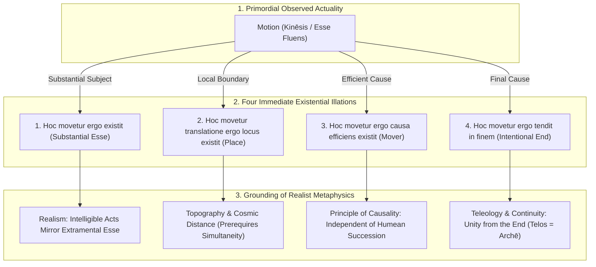

# TRANSLATION NOTES & SCHOLARLY COMMENTARY: APPENDIX

**Work:** Petrus Hoenen, S.J., *De Noetica Geometriae: Origine Theoriae Cognitionis* (Rome: Gregorian University Press, 1954)  
**Section:** Appendix: *De connexionibus necessariis inter actus existentiales* (pp. 249–288)  
**Translator / Epistemological Commentary:** Antigravity (Advanced Agentic Assistant, DeepMind / Geometor Project)  
**Date:** October 2026  

---

## 1. Context and Strategic Significance of the Appendix

Originally published in *Gregorianum* (Vol. 34, 1953, pp. 603–639) under the title *"De connexionibus necessariis inter actus existentiales"* ("On Necessary Connections Between Existential Acts"), this landmark monograph was appended by Father Petrus Hoenen to the 1954 edition of *De Noetica Geometriae* to provide the ultimate **metaphysical and existential justification** for the entire treatise.

Throughout Capita I–VII, Hoenen demonstrated how the human intellect abstracts necessary and exact mathematical relations between **forms and quiddities** (*nexus formales* in intelligible matter). In the Appendix, Hoenen confronts the deeper metaphysical question that has divided philosophy since Descartes, Hume, and Kant:
> **Can the human intellect intuit necessary connections not merely between conceptual forms (essences), but between actual existential acts (*actus existentiales*) in extramental reality?**

Hoenen's response is a decisive, revolutionary breakthrough in Thomistic epistemology:
1. **The Extension of Intuitive Abstraction to Existence:** Just as the mind intuits that figurability flows necessarily from extension (*formal nexus*), so the mind intuits that motion flows necessarily from an existing subject, that local transfer necessarily presupposes an existing place, and that becoming necessarily presupposes an actual efficient cause (*existential nexus*).
2. **The Refutation of David Hume:** David Hume asserted that the human intellect can never see a necessary connection between the existence of one thing ($A$) and the existence of another distinct thing ($B$). Hoenen proves that in physical motion, the intellect directly perceives that motion **"points, as with a finger, to another presupposed existence"** (*motus quasi digito monstrat aliam existentiam*).
3. **The Four Existential Principles of Motion:** Hoenen establishes a fourfold framework of immediate existential illations:
   - *Hoc movetur ergo existit* (Substantial Subject)
   - *Hoc movetur translatione ergo locus existit* (Place / Space)
   - *Hoc movetur ergo causa efficiens existit* (Efficient Causality)
   - *Hoc movetur ergo tendit in finem producendum* (Finality)
4. **The Resolution of Étienne Gilson’s "Center of Darkness":** Engaging with the existential Thomism of Étienne Gilson (*L'être et l'essence*, *Being and Some Philosophers*), Hoenen addresses Gilson's claim that *esse* cannot be conceptualized without collapsing into essentialism. Hoenen shows that St. Thomas explicitly admits a **concept of *esse*** (*ratio essendi*, *conceptio mentis*), not as a quidditative form, but as an act determined by potency:
   $$\textbf{"Esse is not so determined by another as potency by act, but rather as act by potency."}$$
   $$\textit{(« Non sic determinatur esse per aliud sicut potentia per actum, sed magis sicut actus per potentiam », De Pot., q. 7, a. 2, ad 9)}$$
5. **The Epistemological Critique of Albert Einstein:** Hoenen demonstrates that spatial relations and physical distance necessarily presuppose **objective simultaneity in duration**. Einstein’s operational rejection of absolute simultaneity contradicts his own realist definition of spatial localization based on mutual contacts.

---

## 2. Philological & Conceptual Analyses

### 2.1. *Actus Existentialis* (Existential Act)
- **Latin:** *Actus existentialis* / *actus essendi*.
- **Distinction:** In classical Thomism (*ST* I, q. 3, a. 4; q. 7, a. 1), *esse* is not a form, a genus, or an essence; it is the ultimate actuality of all acts (*actualitas omnium actuum*).
- **Application in the Appendix:** Hoenen distinguishes between:
  - *Substantial Esse:* The primary, permanent act of existence of a supposit (*esse per se*).
  - *Accidental Existential Acts:* Secondary acts of existence, notably **motion** (*esse fluens*) and **duration**, which inhere in another (*esse in alio*).
- **Noetic Significance:** The human intellect can intuit necessary connections directly between these existential acts, without needing to pass through abstract quidditative definitions.

### 2.2. *Cogito Ergo Sum* as Immediate Intuition
- **Context:** § 1 (pp. 249–251).
- **Source:** Descartes, *Secundae Responsiones* (AT VII, 140–141); Hoenen's 1937 *Rivista di Filosofia Neo-scolastica* study.
- **The Core Finding:** The *cogito* is **not a syllogism** (it does not presuppose the major premise *"everything that thinks exists"*). It is a **simple intuition of the intellect** in internal experience:
  $$\text{I think (accidental existential act)} \longrightarrow \text{I am (substantial existential act)}$$
- **Aristotelian-Thomistic Precedence:** Aristotle (*Nic. Eth.* IX, 9, 1170a31) and Aquinas (*Q.D. de Veritate*, q. 10, a. 12, ad 7) formulated this centuries before Descartes: *Sentimus nos sentire et intelligimus nos intelligere, et ideo intelligimus nos esse*.

### 2.3. *Energeia* (ἐνέργεια) vs. *Entelecheia* (ἐντελέχεια)
- **Greek:** ἐνέργεια (*energeia*, activity/operation) vs. ἐντελέχεια (*entelecheia*, full actuality/perfection).
- **Philological History:** In *Metaphysics* IX, 3 (1047a30), Aristotle explains that the word *energeia* was historically derived **from movement** (*ek tōn kinēseōn*), because movement is the most obvious and tangible actuality to human perception.
- **Alexander of Aphrodisias:** In his *In Metaph.* (573, 16), Alexander notes:
  $$\text{ἡ ἐνέργεια ἐν κινήσει θεωρεῖται}$$
  (*"actuality is contemplated in motion"*). Motion is the epistemic gateway through which human consciousness first discovers the very notion of actuality.

### 2.4. *Motus Quasi Digito Monstrat Aliam Existentiam*
- **Latin:** *Motus quasi digito monstrat aliam existentiam quae praesupponitur* ("Motion points, as with a finger, to another existence that is presupposed").
- **Target:** David Hume's skepticism (*Treatise of Human Nature*, Bk. I, Pt. III; *Enquiry*, Sect. IV).
- **Hoenen’s Argument:** When we observe a body in local motion, that fluent existential act is radically unintelligible in isolation:
  1. It points to the **existing mobile subject** without which motion cannot exist.
  2. It points to the **existing place** (*locus*) through which translation occurs.
  3. It points to an **actual moving cause** (*causa movens in actu*) that accounts for its becoming.
- The intellect intuits these existences not as psychological associations, but as **objective, necessary conditions of reality**.

### 2.5. *Facio Ergo Materia Rei Factibilis Adest*
- **Latin:** *Facio ergo materia rei factibilis adest* ("I make, therefore the matter of the factible thing is present").
- **Source:** Aristotle, *Metaph.* IX, 9 (1051a32): ποιοῦντες γιγνώσκουσιν; Aquinas, *In IX Metaph.*, lect. 10, no. 1894; Hoenen, *Théorie du jugement*, ch. X, § 5.
- **Epistemological Role:** The definitive realistic test distinguishing authentic perception from hallucination. In pure imagination, I can mentally divide or move a body at will. But an actual physical operation can only take place upon **actual external matter**. The felt resistance and successful completion of an operative act guarantees the actual existence of the external object.

### 2.6. *Differentia* vs. *Diversitas* (*Seipsis Totis*)
- **Latin:** *Differentia* (difference) vs. *diversitas* (diversity).
- **Aristotelian Foundation:** *Metaphysics* X, 3 (1054b23–26); Aquinas, *In X Metaph.*, lect. 4, no. 2017:
  - Things are *different* when they share a common genus and are distinguished by an added specific difference ($A + d_1$ vs. $A + d_2$).
  - Things are *diverse* when they are not the same **by their whole selves** (*seipsis totis*), without any added difference.
- **Application to Modes of Being:** Being (*esse*) is not a genus; therefore diverse modes of being (*esse in se*, *esse in alio*, *esse fluens*) are diverse *seipsis totis*.

---

## 3. Key Historical and Philosophical Debates

### 3.1. The Confrontation with Étienne Gilson: Is *Esse* Conceptualizable?
In § 7 (pp. 273–281), Hoenen enters into respectful but firm critical dialogue with **Étienne Gilson** (*L'être et l'essence*, 1948; *Being and Some Philosophers*, 1949):

| Issue | Étienne Gilson's Thesis | Father Petrus Hoenen's Thomistic Resolution |
| :--- | :--- | :--- |
| **Status of the Concept** | Restricts "concept" to the first operation (apprehension of essence); *esse* is reached only in judgment. | Shows that St. Thomas (*De Pot.* q. 8, a. 1; q. 9, a. 5) uses *conceptio / verbum* for **both** operations; judgment has its own interior word. |
| **Conceptualizability of *Esse*** | Denies that *esse* can be conceived; doing so reduces *esse* to essence ("essentialism"). | Demonstrates that the mind possesses a concept of *esse* as **ratio essendi** (*ST* I, q. 12, a. 4, ad 3; q. 75, a. 6: *apprehendit esse absolutum*). |
| **The "Center of Darkness"** | Gilson calls the transition from essence to existence *"un centre d'obscurité"*. | Hoenen illuminates this darkness: *esse* is determined by essence **not as potency by act, but as act by potency** (*De Pot.* q. 7, a. 2, ad 9). |
| **Operational Definition of *Esse*** | *Esse* is an ineffable act perceived in judgment. | *Esse* is operationally defined in realism: **that which in affirmative judgment is attributed to an apprehended disposition** (*ita est in re*). |

### 3.2. David Hume and the Nature of the Causal Nexus
In § 3 (pp. 259–262), Hoenen refutes Hume's celebrated critique of causality:
- **Hume’s Position:** Causality is nothing more than psychological habit born of repeated observation of constant conjunction ($A$ followed by $B$).
- **Hoenen’s Refutation:**
  1. The intellect intuits the necessity of an efficient cause in motion **immediately, prior to and independently of any repeated observation**.
  2. The principle does not state *which* physical object is the cause (that requires empirical inquiry); it states that motion *in se* demands an actual cause (*energeia ti aition*).
  3. Hume falsely assumed that the causal principle asserts that the cause must act necessarily. Hoenen points out that the cause can be a **free cause**; the principle requires only that an actual cause exist.

### 3.3. Albert Einstein, Spatial Distance, and Temporal Simultaneity
In § 5 (pp. 268–270), Hoenen analyzes the foundations of relativistic mechanics:
- **Einstein's Postulate:** In the Special Theory of Relativity (1905), Einstein denied absolute simultaneity for spatially distant events, defining simultaneity operationally via light-signal exchanges.
- **Hoenen's Counter-Analysis:**
  1. In his 1930 *Forum* paper, Einstein correctly acknowledged that spatial relations (distance) are grounded in **mutual contacts** between bodies.
  2. Hoenen demonstrates that two bodies cannot touch an intermediate body to establish a real distance unless they **exist simultaneously in duration**!
  3. Coexistence in duration is an absolute ontological prerequisite for spatial distance. By denying the objectivity of distant simultaneity, Einstein undermined the metaphysical foundation of his own theory of localization.

### 3.4. Nicole Oresme and the Configurations of Velocity
In § 7 (pp. 284–285), Hoenen draws upon the pioneering medieval physics of **Nicole Oresme** (14th century; *De configurationibus qualitatum et motuum*), as recovered by Anneliese Maier:
- Oresme recognized that **velocity in motion is the exact analogue of intensity in quality**.
- By graphing velocity over time, Oresme created "configurations in fluent *esse*."
- Hoenen applies this to modern wave mechanics: periodic, oscillatory motions (sound waves, electromagnetic radiation, photons) possess intrinsic structural qualities within their fluent *esse*, demonstrating how existential acts mirror essential forms.

---

## 4. The Fourfold Architecture of Existential Principles

### The Crowning Synthesis of the Treatise
With the completion of the Appendix, Father Petrus Hoenen's system stands fully articulated:
- **Capita I–IV:** Solved the problem of necessity and exactitude in mathematics through **intuitive formal abstraction** of continuous extension as intelligible matter.
- **Capita V–VI:** Vindicated the Thomistic demonstrative method against formal axiomatics, and established real corporeal extension as prior to space and duration.
- **Caput VII:** Established mathematical cognition as the **origin of general noetics** (*origo noeticae generalis*), elevating mathematical realism into transcendental metaphysics (*intelligibile est ens* $\to$ *ens de se est intelligibile*).
- **Appendix:** Anchored the entire epistemology in the concrete cosmos through **necessary connections between existential acts**, refuting Humean skepticism, providing a realist critique of Einsteinian relativity, and harmonizing the metaphysics of essence and existence.
