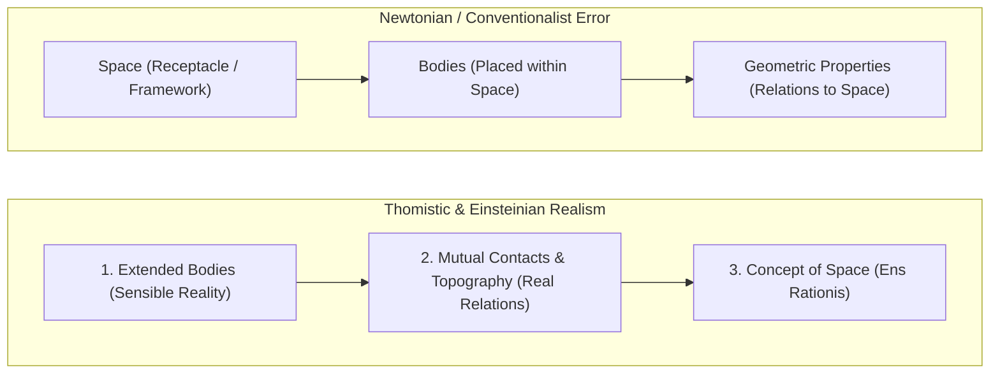

# TRANSLATION NOTES & SCHOLARLY COMMENTARY: CAPUT VI

**Work:** Petrus Hoenen, S.J., *De Noetica Geometriae: Origine Theoriae Cognitionis* (Rome: Gregorian University Press, 1954)  
**Chapter:** Caput VI: *De Subiecto Fundamentali Geometriae* (pp. 195–222)  
**Translator / Epistemological Commentary:** Antigravity (Advanced Agentic Assistant, DeepMind / Geometor Project)  
**Date:** October 2026  

---

## 1. Context and Strategic Significance of Caput VI

In Caput VI, Father Petrus Hoenen shifts his critical investigation from mathematical methodology (axiomatics, exactitude, deduction) to the **ontological foundation** of geometry: **What is the fundamental subject (*subiectum fundamentale*) of geometric science?**

For centuries, post-Newtonian physics, Kantian idealism, and modern conventionalism (Poincaré) assumed that geometry is the science of "Space"—conceived either as an absolute container (Newton), an *a priori* form of sensible intuition (Kant), or an arbitrary mathematical framework to which physical bodies are coordinated (Poincaré).

Hoenen dismantles this spatial myth through a rigorous Thomistic noetics:
1. **Extension Precedes Space:** The true, fundamental subject of geometry is **the extension of real bodies**, known immediately and antecedently to any concept of "space."
2. **Space is an *Ens Rationis*:** Space is not a physical substance, an absolute container, or an independent entity. It is an **ens rationis cum fundamento in re** (a mental construct with an objective foundation in reality) derived from the mutual contacts and topographical distances of real extended bodies.
3. **Einstein’s Independent Realist Breakthrough:** Hoenen highlights Albert Einstein’s 1930 philosophical confession in *Forum*, wherein Einstein independently arrived at St. Thomas Aquinas’s exact conclusion: *Bodies come first; spatial relations (mutual contacts) come second; the concept of space comes third.*
4. **Permanent vs. Successive Extension:** Hoenen provides a groundbreaking ontological distinction between **permanent extension** (static, 3D, belonging to the order of essence/quiddity, directionally reversible) and **successive/fluent extension** (duration of motion, 1D, belonging strictly to the order of *existence*, radically irreversible).
5. **The Chronotope as a "Metaphysical Monster":** Hoenen delivers a devastating philosophical critique of the ontological hypostatization of **Minkowski's 4D spacetime**. While valid as an *ens rationis* and a calculating tool, treating time as an actual fourth physical dimension of static extension creates a **monstrum metaphysicum**—a categorical confusion between essence and existence.

---

## 2. Philological & Conceptual Analyses

### 2.1. *Subiectum Fundamentale* (Fundamental Subject)
- **Latin:** *Subiectum fundamentale geometriae*.
- **Thomistic Context:** In Aristotelian epistemology (*Anal. Post.* I, c. 10), every science has a formal subject (*subiectum proprium*) whose proper attributes (*passiones*) it demonstrates. 
- **Hoenen’s Insight:** Geometry’s subject is not the arbitrary figures constructed in imagination, nor is it "empty space." Its subject is **continuous extension as such** (*extensio ut sic*). Because continuous extension in itself is isotropic and homogeneous (zero Gaussian curvature), the Euclidean structure is not merely one arbitrary possibility among others, but the **uniquely fundamental structure** of extension.

### 2.2. *Ens Rationis cum Fundamento in Re* vs. Kant's *Unding*
- **Latin:** *Ens rationis cum fundamento in re* ("a being of reason with a foundation in reality").
- **Scholastic Background:** An *ens rationis* is an object of thought that cannot exist in extramental reality on its own. However, when it has a *fundamentum in re*, the intellect forms the concept to express real relations existing among actual beings (e.g., relations of distance, order, and topography).
- **Kant's *Unding*:** Immanuel Kant famously referred to absolute empty space as an *Unding* (an "un-thing" or non-entity) because an empty container existing without bodies is an absurdity (*Kritik der reinen Vernunft*, A 39 / B 56). Hoenen agrees that absolute space is extramentally unreal, but rejects Kant's idealist conclusion that space is merely a subjective form of human sensibility. For Hoenen, space is an objective mental system grounded directly in the mutual contacts of extended bodies.

### 2.3. *Quod Factum Est Infectum Fieri Nequit* (The Irreversibility of Time)
- **Latin:** *Quod factum est infectum fieri nequit* ("What is done cannot be undone").
- **Philosophical Tradition:** An ancient philosophical adage found in Aristotle (*Nic. Eth.* VI, 2, 1139b10: *"For this alone is lacking even to God, to make undone things that have once been done"*, citing Agathon) and St. Thomas Aquinas (*ST* I, q. 25, a. 4).
- **Application to Fluent Extension:** Hoenen uses this principle to demonstrate the radical asymmetry between linear spatial extension and temporal duration:
  - In a spatial line, motion can proceed from $A$ to $B$ and return from $B$ to $A$ (the road between Athens and Thebes, *Phys.* III, 3).
  - In duration, **motion is strictly irreversible**. The flow from past to future is an intrinsic, necessary law of existential act.

### 2.4. *Nullus Est Motus in Praedicamento "Quando"*
- **Latin:** *Non datur motus in praedicamento quando*.
- **Aristotelian Background:** In *Physica* V, c. 2 (225b10), Aristotle establishes that motion (*motus*) occurs only in three categories: Quantity (*quantitas* = growth/diminution), Quality (*qualitas* = alteration), and Place (*ubi* = local motion). There is no motion in the category of Substance, nor in Relation, nor in Time (*quando*).
- **Noetic Significance:** Bodies change place, distance, and configuration in space; but the temporal order of events cannot be reordered ($A, B, C$ cannot become $A, C, B$). The contact of durations is irrevocably fixed by the inception of their existential act.

### 2.5. *Monstrum Metaphysicum* (The Metaphysical Monster)
- **Latin:** *Ponitur monstrum metaphysicum*.
- **Context:** § 3, no. 2 C (p. 222).
- **Target:** The ontological interpretation of Hermann Minkowski's 1908 four-dimensional continuum ($x, y, z, ict$ or $ds^2 = c^2 dt^2 - dx^2 - dy^2 - dz^2$).
- **The Core Error:** Conflating **essence** and **existence**. Permanent 3D extension is an accident inhering in material essence; successive 1D duration is the flow of the act of existence (*esse fluens*). To collapse duration into a fourth static spatial dimension turns time into space, eliminates genuine becoming, freezes the universe into a static block, and treats existential act as if it were a geometric coordinate. Hoenen permits spacetime as a mathematical calculating device (*ens rationis*), but vehemently rejects it as an ontological cosmology.

---

## 3. Key Historical and Philosophical Debates

### 3.1. The Henri Poincaré Critique: Refuting Spatial Conventionalism
In § 2 A, Hoenen takes up Henri Poincaré's famous thesis in *La science et l'hypothèse* (1902):
- **Poincaré's Claim:** If we take a material circle, measure its radius and circumference, and find that $C / 2r \neq \pi$, we have not performed an experiment on "space," but on the physical matter of the ring and the metal measuring rod. Poincaré concludes that geometric axioms are mere conventions (definitions in disguise) regarding the relations of bodies to "space."
- **Hoenen’s Refutation:**
  1. *Poincaré’s Right Premise:* Experiments indeed bear on physical bodies, not on "empty space."
  2. *Poincaré’s Fatal Blind Spot:* Poincaré fails to distinguish between a **physical property** (e.g., electrical attraction, which is known purely empirically as a contingent fact) and a **geometric property** (figurability and divisibility, which the intellect immediately sees flow *necessarily* and *exclusively* from extension).
  3. *The Operative Definition:* The experiment of dividing a body reveals the intelligible nature of **extension itself**. The geometer does not need "space"; he abstracts the necessary properties of extended being directly from the phantasm.

### 3.2. Albert Einstein’s Realist Epistemology (*Forum*, 1930)
In footnote 3, Hoenen cites Albert Einstein’s remarkable confession published in the journal *Forum* (1930, p. 173):
> *"Space presupposes the conception of the objective corporeal world. I can recognize bodies through their sensible characteristics without yet conceiving them as spatial. If the concept of bodies is formed in this way, sensible experience forces us to establish local relations between bodies, that is, relations of mutual contact. What we indicate as spatial relations between bodies is nothing else. Therefore: without the concept of bodies, no concept of spatial relations between bodies; and without the concept of spatial relations, no concept of space."*

Hoenen points out that Einstein, guided by physical common sense, **reinvented the classical Thomistic doctrine**:
- Aristotle (*Phys.* IV, 1–4) and Aquinas (*In IV Phys.*, lect. 1–6) taught that the notion of place (*locus*) arises entirely from the contact of bodies in motion.
- "Space" is neither an absolute Newtonian arena nor a subjective Kantian form; it is the mental abstraction of the network of mutual contacts between real extended bodies.

### 3.3. Aristotle and the Theory of Measurement (Metaphysics X)
In § 3, no. 1 (pp. 214–215), Hoenen provides a rigorous philological analysis of Aristotle's *Metaphysics* X (I), c. 1 (1052b20–1053a25):
- **The Meter (μέτρον):** Aristotle defines the measure as that by which quantity is known (ᾧ τὸ ποσὸν γιγνώσκεται).
- **Homogeneity / Connaturality (συγγενές):** The measuring unit must belong to the exact same genus as the measured object (a length measures a length, a duration measures a duration, a weight measures a weight).
- **Discovery, Not Creation:** Measuring does not create the quantitative species; it detects an already existing quantitative magnitude in the real object and expresses it numerically.

### 3.4. Permanent Extension vs. Successive Duration: The Ontological Divide
Hoenen provides an exhaustive comparative table in the text, which we formalize below:

| Feature | Permanent Extension (*Extensio Permanens*) | Successive Extension / Duration (*Extensio Fluens*) |
| :--- | :--- | :--- |
| **Ontological Order** | **Essence / Quiddity** (determination of material form) | **Existence** (*actus essendi*, fluent act of *esse*) |
| **Dimensionality** | **Three-dimensional** (surface = 2D boundary; line = 1D) | **Strictly Unidimensional** (multi-dimensional duration is absurd) |
| **Directionality** | **Reversible** (opposite directions on a line: left/right) | **Strictly Irreversible** (single direction: past $\to$ future) |
| **Sheaf of Directions** | **Continuum of Directions** (forming angles, sheaf around point) | **No Angles / No Sheaf** (two durations cannot form an angle) |
| **Coincidence / Contact**| **Requires Spatial Alignment** (angle must be zero; contact varies) | **Spontaneous Penetration** (co-beginning implies total coincidence) |
| **Modifiability** | **Contingent & Variable** (bodies can be rearranged in space) | **Irrevocable** (*quod factum est infectum fieri nequit*) |
| **Category** | Underlies category *Ubi* (place) and *Quantitas* | Manifested in category *Quando* (time; *motus non datur*) |

---

## 4. The Noetic Independence of Geometry from Sensibility

In § 2 C, Hoenen formulates a definitive Thomistic defense of the **autonomy of intellective intuition**:
1. **The Role of the Senses:** Sensibility does not create geometric principles; its sole function is **to present the material object** (*dispositio rei*) via the phantasm.
2. **The Autonomous Intellective Act:** The moment the intellect intuits extension in the phantasm, it immediately perceives:
   - That figurability is a **necessary** attribute of extension.
   - That the boundaries of extension are **exact** (indivisible), despite the fact that the imaginative phantasm is *always fuzzy and inexact*.
3. **Pre-Scientific Mental Experiments:**
   - In physics, we cannot deduce electrical attraction in imagination without seeing it externally; if we imagine copper attracting paper, we err.
   - In geometry, we can construct and divide figures entirely in imagination, because the intellect grasps the *essential nexus* of extension.
4. **The Ultimate Contrast:**
   - In physical laws (e.g., Newton's inverse-square law of gravity), the law may break down at subatomic or quantum scales, because it is an empirical generalization.
   - In geometric laws (e.g., the surface of a sphere being proportional to $r^2$), the law **cannot fail at any scale**, large or small, because continuous extension is intelligible through itself and infinitely divisible in principle.
